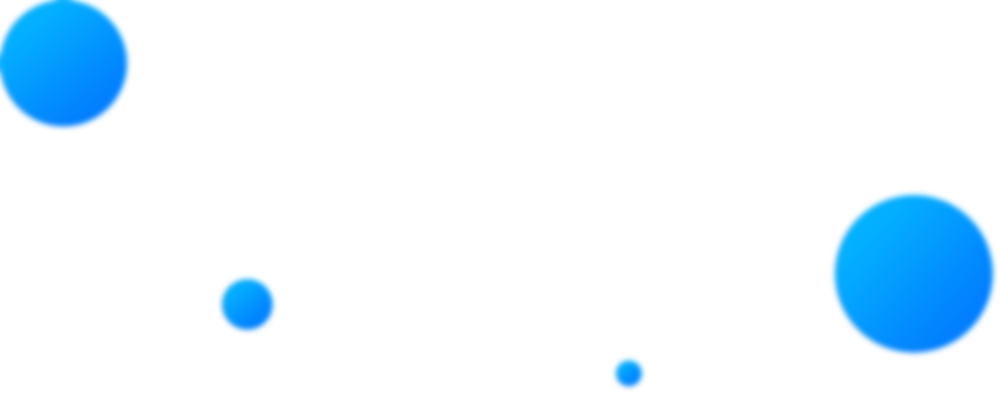
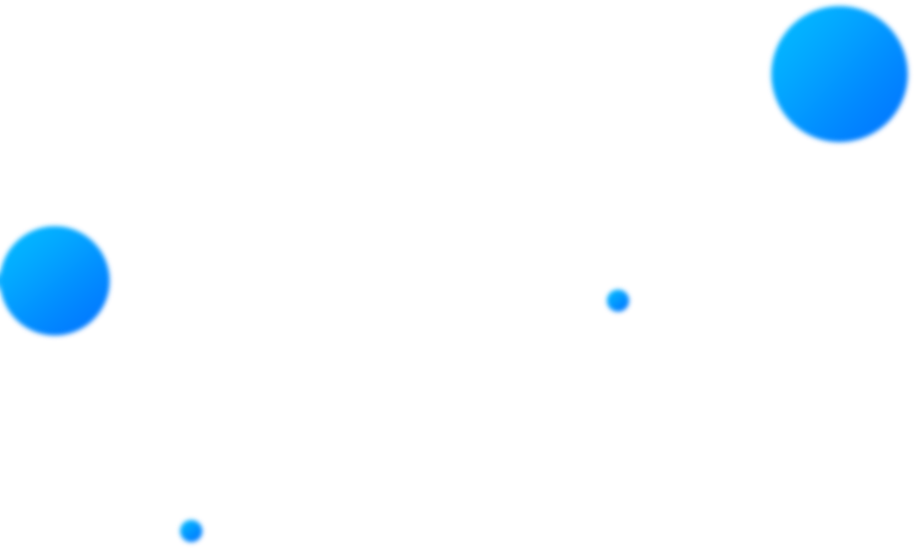

# Ejmiatsin-rp.uk
<!DOCTYPE html>
<html lang="ru">

<head>
    <meta charset="utf-8">
    <meta http-equiv="X-UA-Compatible" content="IE=edge">
    <meta name="yandex-verification" content="d1d0f47634c9bdaf" />
    <title>EJMIATSIN RP PC &#8212; հետաքրքիր օնլայն խաղ Հայաստան համակարգչի վրա</title>
    <meta name="theme-color" content="#fff">
    <meta name="apple-mobile-web-app-status-bar-style" content="black-translucent">
    <meta name="viewport" content="width=device-width, user-scalable=no, initial-scale=1.0, maximum-scale=1.0, minimum-scale=1.0">
    <link rel="apple-touch-icon" sizes="180x180" href="https://smartrp.by/wp-content/themes/smartrp/apple-touch-icon.png">
    <link rel="icon" type="image/png" sizes="32x32" href="https://smartrp.by/wp-content/themes/smartrp/favicon-32x32.png">
    <link rel="icon" type="image/png" sizes="16x16" href="https://smartrp.by/wp-content/themes/smartrp/favicon-16x16.png">
    <link rel="manifest" href="https://smartrp.by/wp-content/themes/smartrp/site.webmanifest">
    <meta name="msapplication-TileColor" content="#da532c">
    <meta name="theme-color" content="#ffffff">
    <link href="https://unpkg.com/aos@2.3.1/dist/aos.css" rel="stylesheet">
   

    
    <noscript>
        

    </noscript>

    <link rel="dns-prefetch" href="//s.w.org" />
    
    
    <link rel="stylesheet" id="wp-block-library-css" href="https://smartrp.by/wp-includes/css/dist/block-library/style.min.css?ver=5.3.15" type="text/css" media="all" />
    <link rel="https://api.w.org/" href="https://smartrp.by/wp-json/" />
    <link rel="EditURI" type="application/rsd+xml" title="RSD" href="https://smartrp.by/xmlrpc.php?rsd" />
    <link rel="wlwmanifest" type="application/wlwmanifest+xml" href="https://smartrp.by/wp-includes/wlwmanifest.xml" />
    <meta name="generator" content="WordPress 5.3.15" />
    <link rel="icon" href="https://smartrp.by/wp-content/uploads/2020/02/sicon.png" sizes="32x32" />
    <link rel="icon" href="https://smartrp.by/wp-content/uploads/2020/02/sicon.png" sizes="192x192" />
    <link rel="apple-touch-icon-precomposed" href="https://smartrp.by/wp-content/uploads/2020/02/sicon.png" />
    <meta name="msapplication-TileImage" content="https://smartrp.by/wp-content/uploads/2020/02/sicon.png" />
    <style>
        /*!normalize.css v8.0.1 | MIT License | github.com/necolas/normalize.css*/

html {
    line-height: 1.15;
    -webkit-text-size-adjust: 100%
}

body {
    margin: 0
}

main {
    display: block
}

h1 {
    font-size: 2em;
    margin: .67em 0
}

hr {
    box-sizing: content-box;
    height: 0;
    overflow: visible
}

pre {
    font-family: monospace, monospace;
    font-size: 1em
}

a {
    background-color: transparent
}

abbr[title] {
    border-bottom: none;
    text-decoration: underline;
    text-decoration: underline dotted
}

b,
strong {
    font-weight: bolder
}

code,
kbd,
samp {
    font-family: monospace, monospace;
    font-size: 1em
}

small {
    font-size: 80%
}

sub,
sup {
    font-size: 75%;
    line-height: 0;
    position: relative;
    vertical-align: baseline
}

sub {
    bottom: -.25em
}

sup {
    top: -.5em
}

img {
    border-style: none
}

button,
input,
optgroup,
select,
textarea {
    font-family: inherit;
    font-size: 100%;
    line-height: 1.15;
    margin: 0
}

button,
input {
    overflow: visible
}

button,
select {
    text-transform: none
}

button,
[type=button],
[type=reset],
[type=submit] {
    -webkit-appearance: button
}

button::-moz-focus-inner,
[type=button]::-moz-focus-inner,
[type=reset]::-moz-focus-inner,
[type=submit]::-moz-focus-inner {
    border-style: none;
    padding: 0
}

button:-moz-focusring,
[type=button]:-moz-focusring,
[type=reset]:-moz-focusring,
[type=submit]:-moz-focusring {
    outline: 1px dotted ButtonText
}

fieldset {
    padding: .35em .75em .625em
}

legend {
    box-sizing: border-box;
    color: inherit;
    display: table;
    max-width: 100%;
    padding: 0;
    white-space: normal
}

progress {
    vertical-align: baseline
}

textarea {
    overflow: auto
}

[type=checkbox],
[type=radio] {
    box-sizing: border-box;
    padding: 0
}

[type=number]::-webkit-inner-spin-button,
[type=number]::-webkit-outer-spin-button {
    height: auto
}

[type=search] {
    -webkit-appearance: textfield;
    outline-offset: -2px
}

[type=search]::-webkit-search-decoration {
    -webkit-appearance: none
}

::-webkit-file-upload-button {
    -webkit-appearance: button;
    font: inherit
}

details {
    display: block
}

summary {
    display: list-item
}

template {
    display: none
}

[hidden] {
    display: none
}

@font-face {
    font-family: proxima nova cn rg;
    src: url(./fonts/ProximaNova/ProximaNovaCond-Regular.eot);
    src: local("Proxima Nova Condensed Regular"), local("ProximaNovaCond-Regular"), url(./fonts/ProximaNova/ProximaNovaCond-Regular.eot?#iefix) format("embedded-opentype"), url(./fonts/ProximaNova/ProximaNovaCond-Regular.woff) format("woff"), url(./fonts/ProximaNova/ProximaNovaCond-Regular.ttf) format("truetype");
    font-weight: 400;
    font-style: normal
}

@font-face {
    font-family: proxima nova th;
    src: url(./fonts/ProximaNova/ProximaNova-Extrabld.eot);
    src: local("Proxima Nova Extrabold"), local("ProximaNova-Extrabld"), url(./fonts/ProximaNova/ProximaNova-Extrabld.eot?#iefix) format("embedded-opentype"), url(./fonts/ProximaNova/ProximaNova-Extrabld.woff) format("woff"), url(./fonts/ProximaNova/ProximaNova-Extrabld.ttf) format("truetype");
    font-weight: 800;
    font-style: normal
}

@font-face {
    font-family: proxima nova cn bl;
    src: url(./fonts/ProximaNova/ProximaNovaCond-Black.eot);
    src: local("Proxima Nova Condensed Black"), local("ProximaNovaCond-Black"), url(./fonts/ProximaNova/ProximaNovaCond-Black.eot?#iefix) format("embedded-opentype"), url(./fonts/ProximaNova/ProximaNovaCond-Black.woff) format("woff"), url(./fonts/ProximaNova/ProximaNovaCond-Black.ttf) format("truetype");
    font-weight: 900;
    font-style: normal
}

@font-face {
    font-family: proxima nova rg;
    src: url(./fonts/ProximaNova/ProximaNova-Regular.eot);
    src: local("Proxima Nova Regular"), local("ProximaNova-Regular"), url(./fonts/ProximaNova/ProximaNova-Regular.eot?#iefix) format("embedded-opentype"), url(./fonts/ProximaNova/ProximaNova-Regular.woff) format("woff"), url(./fonts/ProximaNova/ProximaNova-Regular.ttf) format("truetype");
    font-weight: 400;
    font-style: normal
}

@font-face {
    font-family: proxima nova lt;
    src: url(./fonts/ProximaNova/ProximaNova-Semibold.eot);
    src: local("Proxima Nova Semibold"), local("ProximaNova-Semibold"), url(./fonts/ProximaNova/ProximaNova-Semibold.eot?#iefix) format("embedded-opentype"), url(./fonts/ProximaNova/ProximaNova-Semibold.woff) format("woff"), url(./fonts/ProximaNova/ProximaNova-Semibold.ttf) format("truetype");
    font-weight: 600;
    font-style: normal
}

@font-face {
    font-family: proxima nova excn th;
    src: url(./fonts/ProximaNova/ProximaNovaExCn-Thin.eot);
    src: local("Proxima Nova Extra Condensed Thin"), local("ProximaNovaExCn-Thin"), url(./fonts/ProximaNova/ProximaNovaExCn-Thin.eot?#iefix) format("embedded-opentype"), url(./fonts/ProximaNova/ProximaNovaExCn-Thin.woff) format("woff"), url(./fonts/ProximaNova/ProximaNovaExCn-Thin.ttf) format("truetype");
    font-weight: 100;
    font-style: normal
}

@font-face {
    font-family: proxima nova cn lt;
    src: url(./fonts/ProximaNova/ProximaNovaCond-Semibold.eot);
    src: local("Proxima Nova Condensed Semibold"), local("ProximaNovaCond-Semibold"), url(./fonts/ProximaNova/ProximaNovaCond-Semibold.eot?#iefix) format("embedded-opentype"), url(./fonts/ProximaNova/ProximaNovaCond-Semibold.woff) format("woff"), url(./fonts/ProximaNova/ProximaNovaCond-Semibold.ttf) format("truetype");
    font-weight: 600;
    font-style: normal
}

@font-face {
    font-family: proxima nova excn lt;
    src: url(./fonts/ProximaNova/ProximaNovaExCn-Semibold.eot);
    src: local("Proxima Nova Extra Condensed Semibold"), local("ProximaNovaExCn-Semibold"), url(./fonts/ProximaNova/ProximaNovaExCn-Semibold.eot?#iefix) format("embedded-opentype"), url(./fonts/ProximaNova/ProximaNovaExCn-Semibold.woff) format("woff"), url(./fonts/ProximaNova/ProximaNovaExCn-Semibold.ttf) format("truetype");
    font-weight: 600;
    font-style: normal
}

@font-face {
    font-family: proxima nova cn th;
    src: url(./fonts/ProximaNova/ProximaNovaCond-Thin.eot);
    src: local("Proxima Nova Condensed Thin"), local("ProximaNovaCond-Thin"), url(./fonts/ProximaNova/ProximaNovaCond-Thin.eot?#iefix) format("embedded-opentype"), url(./fonts/ProximaNova/ProximaNovaCond-Thin.woff) format("woff"), url(./fonts/ProximaNova/ProximaNovaCond-Thin.ttf) format("truetype");
    font-weight: 100;
    font-style: normal
}

@font-face {
    font-family: proxima nova cn th;
    src: url(./fonts/ProximaNova/ProximaNovaCond-Extrabld.eot);
    src: local("Proxima Nova Condensed Extrabold"), local("ProximaNovaCond-Extrabld"), url(./fonts/ProximaNova/ProximaNovaCond-Extrabld.eot?#iefix) format("embedded-opentype"), url(./fonts/ProximaNova/ProximaNovaCond-Extrabld.woff) format("woff"), url(./fonts/ProximaNova/ProximaNovaCond-Extrabld.ttf) format("truetype");
    font-weight: 800;
    font-style: normal
}

@font-face {
    font-family: proxima nova excn lt;
    src: url(./fonts/ProximaNova/ProximaNovaExCn-Light.eot);
    src: local("Proxima Nova Extra Condensed Light"), local("ProximaNovaExCn-Light"), url(./fonts/ProximaNova/ProximaNovaExCn-Light.eot?#iefix) format("embedded-opentype"), url(./fonts/ProximaNova/ProximaNovaExCn-Light.woff) format("woff"), url(./fonts/ProximaNova/ProximaNovaExCn-Light.ttf) format("truetype");
    font-weight: 300;
    font-style: normal
}

@font-face {
    font-family: proxima nova excn th;
    src: url(./fonts/ProximaNova/ProximaNovaExCn-Extrabld.eot);
    src: local("Proxima Nova Extra Condensed Extrabold"), local("ProximaNovaExCn-Extrabld"), url(./fonts/ProximaNova/ProximaNovaExCn-Extrabld.eot?#iefix) format("embedded-opentype"), url(./fonts/ProximaNova/ProximaNovaExCn-Extrabld.woff) format("woff"), url(./fonts/ProximaNova/ProximaNovaExCn-Extrabld.ttf) format("truetype");
    font-weight: 800;
    font-style: normal
}

@font-face {
    font-family: proxima nova bl;
    src: url(./fonts/ProximaNova/ProximaNova-Black.eot);
    src: local("Proxima Nova Black"), local("ProximaNova-Black"), url(./fonts/ProximaNova/ProximaNova-Black.eot?#iefix) format("embedded-opentype"), url(./fonts/ProximaNova/ProximaNova-Black.woff) format("woff"), url(./fonts/ProximaNova/ProximaNova-Black.ttf) format("truetype");
    font-weight: 900;
    font-style: normal
}

@font-face {
    font-family: proxima nova rg;
    src: url(./fonts/ProximaNova/ProximaNova-Bold.eot);
    src: local("Proxima Nova Bold"), local("ProximaNova-Bold"), url(./fonts/ProximaNova/ProximaNova-Bold.eot?#iefix) format("embedded-opentype"), url(./fonts/ProximaNova/ProximaNova-Bold.woff) format("woff"), url(./fonts/ProximaNova/ProximaNova-Bold.ttf) format("truetype");
    font-weight: 700;
    font-style: normal
}

@font-face {
    font-family: proxima nova excn rg;
    src: url(./fonts/ProximaNova/ProximaNovaExCn-Bold.eot);
    src: local("Proxima Nova Extra Condensed Bold"), local("ProximaNovaExCn-Bold"), url(./fonts/ProximaNova/ProximaNovaExCn-Bold.eot?#iefix) format("embedded-opentype"), url(./fonts/ProximaNova/ProximaNovaExCn-Bold.woff) format("woff"), url(./fonts/ProximaNova/ProximaNovaExCn-Bold.ttf) format("truetype");
    font-weight: 700;
    font-style: normal
}

@font-face {
    font-family: proxima nova th;
    src: url(./fonts/ProximaNova/ProximaNovaT-Thin.eot);
    src: local("Proxima Nova Thin"), local("ProximaNovaT-Thin"), url(./fonts/ProximaNova/ProximaNovaT-Thin.eot?#iefix) format("embedded-opentype"), url(./fonts/ProximaNova/ProximaNovaT-Thin.woff) format("woff"), url(./fonts/ProximaNova/ProximaNovaT-Thin.ttf) format("truetype");
    font-weight: 100;
    font-style: normal
}

@font-face {
    font-family: proxima nova cn rg;
    src: url(./fonts/ProximaNova/ProximaNovaCond-Bold.eot);
    src: local("Proxima Nova Condensed Bold"), local("ProximaNovaCond-Bold"), url(./fonts/ProximaNova/ProximaNovaCond-Bold.eot?#iefix) format("embedded-opentype"), url(./fonts/ProximaNova/ProximaNovaCond-Bold.woff) format("woff"), url(./fonts/ProximaNova/ProximaNovaCond-Bold.ttf) format("truetype");
    font-weight: 700;
    font-style: normal
}

@font-face {
    font-family: proxima nova excn bl;
    src: url(./fonts/ProximaNova/ProximaNovaExCn-Black.eot);
    src: local("Proxima Nova Extra Condensed Black"), local("ProximaNovaExCn-Black"), url(./fonts/ProximaNova/ProximaNovaExCn-Black.eot?#iefix) format("embedded-opentype"), url(./fonts/ProximaNova/ProximaNovaExCn-Black.woff) format("woff"), url(./fonts/ProximaNova/ProximaNovaExCn-Black.ttf) format("truetype");
    font-weight: 900;
    font-style: normal
}

@font-face {
    font-family: proxima nova cn lt;
    src: url(./fonts/ProximaNova/ProximaNovaCond-Light.eot);
    src: local("Proxima Nova Condensed Light"), local("ProximaNovaCond-Light"), url(./fonts/ProximaNova/ProximaNovaCond-Light.eot?#iefix) format("embedded-opentype"), url(./fonts/ProximaNova/ProximaNovaCond-Light.woff) format("woff"), url(./fonts/ProximaNova/ProximaNovaCond-Light.ttf) format("truetype");
    font-weight: 300;
    font-style: normal
}

@font-face {
    font-family: proxima nova excn rg;
    src: url(./fonts/ProximaNova/ProximaNovaExCn-Regular.eot);
    src: local("Proxima Nova Extra Condensed Regular"), local("ProximaNovaExCn-Regular"), url(./fonts/ProximaNova/ProximaNovaExCn-Regular.eot?#iefix) format("embedded-opentype"), url(./fonts/ProximaNova/ProximaNovaExCn-Regular.woff) format("woff"), url(./fonts/ProximaNova/ProximaNovaExCn-Regular.ttf) format("truetype");
    font-weight: 400;
    font-style: normal
}

@font-face {
    font-family: proxima nova lt;
    src: url(./fonts/ProximaNova/ProximaNova-Light.eot);
    src: local("Proxima Nova Light"), local("ProximaNova-Light"), url(./fonts/ProximaNova/ProximaNova-Light.eot?#iefix) format("embedded-opentype"), url(./fonts/ProximaNova/ProximaNova-Light.woff) format("woff"), url(./fonts/ProximaNova/ProximaNova-Light.ttf) format("truetype");
    font-weight: 300;
    font-style: normal
}

.container {
    max-width: 75rem;
    margin: 0 auto;
    padding-left: .9375rem;
    padding-right: .9375rem
}

* {
    box-sizing: border-box
}

body {
    font-family: proxima nova rg, sans-serif;
    color: #131313;
    background-color: #eeeff7
}

h1,
h2,
h3,
h4,
h5,
h6,
ul {
    margin: 0;
    padding: 0;
    list-style: none
}

a {
    text-decoration: none;
    transition: .34s;
    display: inline-block
}

a:hover {
    color: #08f
}

img {
    max-width: 100%
}

textarea {
    resize: none
}

.text-left {
    text-align: left
}

.text-center {
    text-align: center
}

.text-right {
    text-align: right
}

.upper {
    text-transform: uppercase
}

.trans {
    transition: .34s
}

.nowrap {
    white-space: nowrap
}

.row-flex {
    display: flex;
    flex-wrap: wrap;
    margin-left: -.9375rem;
    margin-right: -.9375rem
}

.row-reverse {
    flex-flow: row-reverse
}

.col {
    box-sizing: border-box;
    word-wrap: break-word;
    margin-left: .9375rem;
    margin-right: .9375rem
}

.flex {
    display: flex
}

.flex-wrap {
    flex-wrap: wrap
}

.flex-nowrap {
    flex-wrap: nowrap
}

.flex-inline {
    display: inline-flex
}

.j-center {
    justify-content: center
}

.j-between {
    justify-content: space-between
}

.j-end {
    justify-content: flex-end
}

.a-center {
    align-items: center
}

.w-100 {
    width: 100%
}

.btn {
    outline: none;
    background: 0 0;
    border: none;
    text-align: center;
    cursor: pointer;
    transition: .34s;
    font-family: proxima nova lt;
    font-weight: 600;
    border-radius: 50px
}

.btn.disabled {
    filter: grayscale(100%);
    pointer-events: none
}

.btn_blue {
    color: #fff;
    background-color: #5cbafb;
    background-image: linear-gradient(-93deg, #03b8ff 0%, #03b8ff 1%, #0278ff 99%, #0278ff 100%)
}

.btn_blue:hover {
    box-shadow: 0 0 20px 2px rgba(0, 136, 255, .8);
    color: #fff
}

.btn_trans {
    position: relative;
    color: #151414;
    border: 1px solid #000
}

.btn_trans:before {
    content: "";
    position: absolute;
    z-index: -1;
    left: 0;
    right: 0;
    top: 0;
    bottom: 0;
    opacity: 0;
    transition: .34s;
    border-radius: 50px;
    background-color: #0086ff;
    background-image: linear-gradient(to left, #0278ff 0%, #0278ff 1%, #03b8ff 99%, #03b8ff 100%)
}

.btn_trans:hover {
    color: #fff;
    border-color: #03b8ff;
    box-shadow: 0 0 15px 1px rgba(0, 136, 255, .5);
    opacity: .99
}

.btn_trans:hover:before {
    opacity: 1
}

.btn-icon {
    display: flex;
    align-items: center;
    padding: 8px
}

.btn__icon {
    width: 62px;
    height: 62px;
    background-color: #fff;
    border-radius: 50%;
    margin-right: 28px
}

.btn__value {
    padding-right: 53px
}

.navbar {
    width: calc(41.66667% - 1.875rem)
}

.auth {
    width: calc(41.66667% - 1.875rem);
    text-align: right
}

.checkbox {
    display: block;
    position: relative;
    padding-left: 39px;
    margin-bottom: 12px;
    cursor: pointer;
    -webkit-user-select: none;
    -moz-user-select: none;
    -ms-user-select: none;
    user-select: none;
    color: #131313;
    font-size: 15px
}

.checkbox a {
    color: #131313;
    text-decoration: underline
}

.checkbox a:hover {
    color: #08f
}

.checkbox__input {
    position: absolute;
    opacity: 0;
    cursor: pointer;
    height: 0;
    width: 0
}

.checkbox__input:checked~.checkbox__mark:after {
    display: block
}

.checkbox__mark {
    position: absolute;
    top: -8px;
    left: 0;
    width: 31px;
    height: 31px;
    box-shadow: inset 1px 5px 8px rgba(0, 0, 0, .04);
    background-color: #fff;
    border-radius: 50%
}

.checkbox__mark:after {
    content: "";
    position: absolute;
    display: none;
    left: 12px;
    top: 8px;
    width: 5px;
    height: 10px;
    border: solid #121212;
    border-width: 0 2px 2px 0;
    border-radius: 1px;
    -webkit-transform: rotate(45deg);
    -ms-transform: rotate(45deg);
    transform: rotate(45deg)
}

.input {
    border: none;
    background: 0 0;
    outline: none;
    padding: 30px 49px;
    transition: .34s;
    box-shadow: inset 1px 5px 8px rgba(0, 0, 0, .04);
    border-radius: 50px;
    background-color: #fff;
    height: 85px;
    font-size: 17px;
    border: 1px solid transparent
}

.input:focus {
    border-color: #08f;
    box-shadow: 0 0 10px 1px rgba(0, 136, 255, .5)
}

.input__label {
    color: #383838;
    font-size: 20px;
    font-weight: 500;
    display: block
}

.input__caption {
    color: #383838;
    font-size: 12px;
    font-weight: 400;
    margin-top: 12px
}

.group {
    margin-bottom: 22px
}

.sections-wrap {
    position: relative;
    overflow: hidden
}

.sections-wrap__image {
    position: absolute;
    top: 50%;
    left: 50%;
    transform: translate(-50%, -50%);
    max-width: 120%
}

.section {
    overflow: hidden
}

.section__title {
    position: relative;
    color: #131313;
    font-size: 45px;
    font-weight: 700;
    padding-top: 60px
}

.section__title::before {
    content: attr(data-back-font);
    position: absolute;
    left: 0;
    right: 0;
    bottom: 0;
    margin: auto;
    color: rgba(19, 19, 19, .04);
    font-size: 139px;
    font-weight: 700;
    text-transform: uppercase;
    line-height: .8
}

.section__title-value {
    position: relative;
    display: inline-block;
    opacity: .99
}

.section__title-value:before {
    content: "";
    position: absolute;
    z-index: -1;
    left: -12px;
    bottom: 9px;
    width: 174px;
    height: 6px;
    border-radius: 3px;
    background-color: #08f
}

.scene {
    position: absolute;
    left: 0;
    right: 0;
    top: 0;
    bottom: 0
}

.scene__layer {
    position: absolute;
    height: 100%;
    width: 100%;
    padding: 0;
    margin: 0
}

.select {
    position: relative;
    cursor: pointer
}

.select select,
.select-hide {
    display: none
}

.select-items {
    position: absolute;
    top: 100%;
    left: 0;
    right: 0;
    z-index: 99;
    background-color: #fff;
    border-radius: 50px;
    text-align: center;
    overflow: hidden;
    border: 2px solid #eee
}

.select-items div {
    padding: 12px 15px
}

.select-items div:hover {
    background-color: #08f;
    color: #fff
}

.select-items div+div {
    border-top: 1px solid #eee
}

.select-selected {
    display: flex;
    align-items: center
}

.select-selected.placeholder {
    color: rgba(19, 19, 19, .5)
}

.select-selected:after {
    position: absolute;
    right: 35px;
    top: 50%;
    transform: translateY(-50%);
    content: "";
    width: 25px;
    height: 13px;
    transition: .34s;
    transform-origin: center;
    background: url(./img/dropdown.png) center no-repeat;
    background-size: contain
}

.select-selected.select-arrow-active:after {
    transform: rotate(180deg) translateY(7px);
    transform-origin: center
}

.form-page {
    position: relative;
    padding: 205px 0 135px;
    background: url(./img/jumb-pattern.png)
}

.form-page__checkbox {
    position: relative;
    margin: 30px 0
}

.form-page__checkbox:before {
    content: "";
    position: absolute;
    background: url(./img/form-page-dash.png) center no-repeat;
    background-size: contain;
    top: 0;
    right: 0;
    transform: translate(100%, -60%);
    width: 54px;
    height: 106px
}

.form-page__caption {
    color: #131313;
    font-size: 16px;
    font-family: proxima nova lt;
    font-weight: 600;
    margin-top: 40px
}

.form-page__form {
    max-width: 440px;
    width: 100%;
    margin: 45px auto 0
}

.form-page__btn {
    padding: 35px 40px;
    color: #fff;
    font-size: 26px;
    box-shadow: -1px 7px 30px 2px rgba(17, 143, 255, .6)
}

.form-page__currency {
    color: #181818;
    font-family: proxima nova lt;
    margin-top: 90px;
    font-size: 19px;
    font-weight: 600
}

.form-page__currency-line+.form-page__currency-line {
    margin-top: 22px
}

.jumb {
    position: relative;
    min-height: 100vh;
    padding: 120px 0;
    background: url(./img/jumb-pattern.png)
}

.jumb__main {
    position: relative
}

.jumb__play {
    margin-left: auto;
    transform: translateX(100%)
}

.jumb__play:hover img {
    transform: scale(1.1)
}

.jumb__play-wrap {
    text-align: right;
    margin-bottom: -10px
}

.jumb__play-value {
    color: #010101;
    font-size: 16px;
    line-height: 14.75px
}

.jumb__play-icon {
    margin-right: 24px;
    box-shadow: 0 0 0 0 #08f;
    transform: scale(1);
    border-radius: 50%;
    animation: borderPulse 1600ms infinite ease-out;
    line-height: 0
}

.jumb__play-icon img {
    width: 54px;
    height: 54px;
    transition: .34s
}

@keyframes borderPulse {
    0% {
        box-shadow: inset 0 0 0 5px rgba(255, 255, 255, .4), 0 0 0 0 #08f, 0 20px 40px #437eef40
    }
    100% {
        box-shadow: inset 0 0 0 3px rgba(117, 117, 255, .2), 0 0 4px 15px transparent, 0 20px 40px #437eef40
    }
}

.jumb__bubble {
    position: absolute;
    left: 50%;
    top: 30%;
    margin: auto;
    transform: translate(-50%, -50%);
    max-width: 120%
}

.jumb__car {
    position: absolute
}

.jumb__car-left {
    left: 0;
    transform: translateX(-3%);
    bottom: 3%
}

.jumb__car-right {
    right: 0;
    bottom: 3%;
    transform: translateX(40%)
}

.jumb__title {
    background-image: linear-gradient(-248deg, #03b8ff 0%, #03b8ff 1%, #0278ff 99%, #0278ff 100%);
    line-height: 1;
    background-clip: text;
    -webkit-background-clip: text;
    -webkit-text-fill-color: transparent;
    color: #0073da;
    font-family: proxima nova th;
    font-size: 105px;
    font-weight: 800;
    display: inline-block
}

.jumb__caption {
    color: #0d0d0d;
    font-family: proxima nova lt;
    font-size: 28px;
    font-weight: 300
}

.jumb__btn {
    position: relative;
    color: #fff;
    font-family: proxima nova lt;
    font-size: 24px;
    font-weight: 600;
    margin: auto;
    box-shadow: -1px 7px 30px 2px rgba(17, 143, 255, .6)
}

.jumb__btn-wrap {
    position: relative;
    margin-top: 58px;
    display: inline-block
}

.jumb__btn-wrap:before {
    content: "";
    position: absolute;
    bottom: 40%;
    right: 0;
    transition: .34s;
    transform: translateX(130%);
    background: url(./img/jumb-connect.png) center no-repeat;
    background-size: contain;
    width: 71px;
    height: 90px
}

.jumb__btn:hover {
    transform: scale(1.1);
    box-shadow: 0 0 0 0 rgba(17, 143, 255, .6)
}

.jumb__btn-icon {
    background-image: url(./img/svg/download.svg);
    background-repeat: no-repeat;
    background-position: center;
    background-size: 25px
}

.news {
    padding-top: 130px;
    padding-bottom: 105px
}

.news__preview {
    background-size: cover;
    background-repeat: no-repeat;
    background-position: center;
    height: 220px
}

.news__item {
    width: calc(33.33333% - 1.875rem);
    box-shadow: 0 25px 57px rgba(0, 0, 0, .09);
    border-radius: 21px;
    background-color: #fff;
    overflow: hidden
}

.news__info {
    padding: 30px 30px 40px
}

.news__title {
    font-family: proxima nova lt;
    font-size: 20px;
    font-weight: 600;
    margin-bottom: 20px
}

.news__list {
    margin-top: 100px
}

.news__descr {
    font-size: 14px;
    margin-bottom: 25px
}

.news__date {
    color: rgba(19, 19, 19, .3);
    font-size: 15px
}

.news__detail {
    padding: 14px 32px;
    font-size: 14px;
    font-weight: 400
}

.contacts {
    padding-top: 105px;
    padding-bottom: 160px
}

.contacts__item {
    width: calc(33.33333% - 1.875rem)
}

.contacts__list {
    margin-top: 110px
}

.contacts__image {
    height: 140px;
    display: flex;
    justify-content: center;
    align-items: center
}

.contacts__image img {
    max-height: 100%
}

.contacts__subtitle {
    font-family: proxima nova lt;
    font-size: 40px;
    font-weight: 600;
    margin: 45px 0
}

.contacts__btn {
    padding: 24px 70px;
    color: rgba(16, 16, 16, .3);
    font-family: proxima nova rg, sans-serif;
    font-size: 24px;
    font-weight: 400;
    border: 1px solid rgba(0, 0, 0, .3)
}

.cabinet {
    position: relative;
    padding: 205px 0 135px;
    background: url(./img/jumb-pattern.png)
}

.cabinet__inner {
    position: relative;
    padding: 35px 120px 50px 75px;
    border-radius: 23px;
    background-color: #fff;
    max-width: 1105px;
    width: 100%;
    margin-top: 85px
}

.cabinet__exit {
    position: absolute;
    right: 0;
    top: 0;
    transform: translate(50%, -50%);
    width: 55px;
    height: 55px;
    padding: 0
}

.cabinet__exit img {
    width: 22px;
    height: 22px;
    margin-left: 5px
}

.cabinet__subtitle {
    color: #111;
    font-family: proxima nova lt;
    font-size: 23px;
    font-weight: 600;
    margin-bottom: 27px
}

.cabinet__user {
    width: 60%;
    padding-right: 25px
}

.cabinet__autopark {
    width: 40%
}

.user__name {
    color: #181818;
    font-family: proxima nova lt;
    font-size: 21px;
    font-weight: 600;
    margin-bottom: 18px
}

.user__photo {
    width: 158px;
    height: 158px;
    background-color: #eeeff7;
    border-radius: 50%;
    margin-right: 17px;
    flex-shrink: 0
}

.user__photo-inner {
    width: 110px;
    height: 110px;
    background-color: #fff;
    border-radius: 50%
}

.user__photo img {
    height: 45px;
    width: 45px
}

.user__info {
    margin-left: 175px
}

.user__row {
    display: flex;
    color: rgba(184, 184, 184, .9);
    font-family: proxima nova lt;
    font-size: 16px;
    font-weight: 600
}

.user__row+.user__row {
    margin-top: 18px
}

.user__row-value {
    color: #121212;
    margin-left: 5px
}

.user__row-value.alert {
    color: red
}

.user__list {
    margin-top: 20px
}

.user__btn {
    margin-top: 30px;
    padding: 20px 54px;
    font-size: 15px
}

.user__circle-list {
    margin-top: 0;
    margin-left: 20px
}

.user__circle-row+.user__circle-row {
    margin-top: 14px
}

.autopark {
    position: relative;
    min-width: 0;
    counter-reset: autopark;
    padding-left: 75px
}

.autopark:before {
    content: "";
    position: absolute;
    top: 50%;
    transform: translateY(-50%);
    left: 0;
    width: 1px;
    height: 393px;
    background-color: rgba(30, 33, 42, .32)
}

.autopark__list {
    padding-top: 17px
}

.autopark__item {
    display: flex;
    align-items: center;
    border-radius: 31px;
    background-color: #eeeff7;
    padding: 7px;
    color: #111;
    font-family: proxima nova lt;
    font-size: 14px;
    font-weight: 600;
    width: 100%;
    flex-shrink: 0
}

.autopark__item+.autopark__item {
    margin-top: 17px
}

.autopark__item:before {
    counter-increment: autopark;
    content: counter(autopark);
    display: flex;
    justify-content: center;
    align-items: center;
    width: 49px;
    height: 49px;
    border-radius: 50%;
    color: #fff;
    font-family: proxima nova lt;
    font-size: 16px;
    flex-shrink: 0;
    font-weight: 600;
    background-color: #fff;
    background-image: linear-gradient(-245deg, #03b8ff 0%, #03b8ff 1%, #0278ff 99%, #0278ff 100%)
}

.autopark__name {
    padding: 13px;
    overflow: hidden;
    text-overflow: ellipsis;
    white-space: nowrap
}

.loader {
    position: relative;
    user-select: none;
    box-sizing: border-box;
    width: 150px;
    height: 150px
}

.loader-bg {
    width: 100%;
    height: 100%;
    border-radius: 50%;
    box-sizing: border-box;
    border: 7px solid #d9ddff;
    display: flex;
    align-items: center;
    justify-content: center
}

.spinner-holder-one {
    position: absolute;
    top: 0;
    left: 0;
    overflow: hidden;
    width: 50%;
    height: 50%;
    background: 0 0;
    box-sizing: border-box
}

.spinner-holder-two {
    position: absolute;
    top: 0;
    left: 0;
    overflow: hidden;
    width: 100%;
    height: 100%;
    background: 0 0;
    box-sizing: border-box
}

.loader-spinner {
    width: 200%;
    height: 200%;
    border-radius: 50%;
    border: 7px solid #08f;
    box-sizing: border-box
}

.animate-0-25-a {
    transform: rotate(90deg);
    transform-origin: 100% 100%
}

.animate-0-25-b {
    transform: rotate(-90deg);
    transform-origin: 100% 100%
}

.animate-25-50-a {
    transform: rotate(180deg);
    transform-origin: 100% 100%
}

.animate-25-50-b {
    transform: rotate(-90deg);
    transform-origin: 100% 100%
}

.animate-50-75-a {
    transform: rotate(270deg);
    transform-origin: 100% 100%
}

.animate-50-75-b {
    transform: rotate(-90deg);
    transform-origin: 100% 100%
}

.animate-75-100-a {
    transform: rotate(0deg);
    transform-origin: 100% 100%
}

.animate-75-100-b {
    transform: rotate(-90deg);
    transform-origin: 100% 100%
}

.circle {
    margin-bottom: 20px
}

.circle+.circle {
    margin-left: 10px
}

.circle-text {
    text-align: center;
    color: #181818;
    font-family: proxima nova lt;
    font-size: 16px;
    font-weight: 600
}

.circle-caption {
    color: rgba(24, 24, 24, .3);
    font-family: proxima nova lt;
    font-size: 13px;
    font-weight: 600;
    padding-top: 7px
}

.rating {
    max-width: 960px;
    position: relative;
    margin: auto
}

.rating-tabs {
    display: flex;
    align-items: center;
    justify-content: center;
    margin-top: 50px
}

.rating-tabs__item {
    border: 1px solid #000;
    padding: 15px 45px;
    white-space: nowrap;
    text-transform: uppercase;
    font-size: 12px;
    font-weight: 700;
    border-radius: 30px;
    transition: .35s;
    cursor: pointer;
    text-align: center
}

.rating-tabs__item:hover {
    color: #5cbafb;
    border-color: #5cbafb
}

.rating-tabs__item+.rating-tabs__item {
    margin-left: 12px
}

.rating-tabs__item.active {
    background-color: #5cbafb;
    border: transparent;
    color: #fff;
    pointer-events: none
}

.rating-tab {
    display: none
}

.rating-main {
    display: flex;
    align-items: flex-end;
    justify-content: space-between;
    text-align: center;
    color: #fff;
    margin-top: 45px
}

.rating-main__item {
    display: flex;
    flex-flow: column;
    justify-content: space-between;
    width: 32%;
    flex-shrink: 0;
    align-items: center;
    padding: 25px 20px 50px;
    border-radius: 30px;
    height: 250px
}

.rating-main__item>* {
    white-space: nowrap;
    overflow: hidden;
    text-overflow: ellipsis;
    flex-shrink: 0;
    max-width: 100%
}

.rating-main__num {
    font-size: 30px;
    font-weight: 700;
    display: flex;
    align-items: center
}

.rating-main__num img {
    filter: invert(100%) sepia(98%) saturate(8%) hue-rotate(64deg) brightness(104%) contrast(100%);
    width: 38px;
    height: 38px;
    margin-right: 16px
}

.rating-main__first .rating-main__num {
    display: flex;
    padding-top: 25px
}

.rating-main__name {
    font-size: 20px;
    font-weight: 700
}

.rating-main__value {
    font-size: 25px;
    font-weight: 700
}

.rating-main__first {
    background-color: #131313;
    background-image: linear-gradient(to left, #f39c3e 0, #eebd43 100%);
    height: 280px;
    box-shadow: 0 0 40px 2px #f1a540
}

.rating-main__second {
    background-color: #999696;
    box-shadow: 0 0 40px 2px #999696
}

.rating-main__third {
    background-color: #c6734d;
    box-shadow: 0 0 40px 2px #c6734d
}

.rating-list {
    margin-top: 55px
}

.rating-list__head {
    display: flex;
    align-items: center;
    text-align: center;
    margin-bottom: 30px;
    padding-left: 20px;
    padding-right: 20px
}

.rating-list__head>* {
    flex: 1;
    line-height: 1;
    white-space: nowrap;
    text-overflow: ellipsis;
    overflow: hidden
}

.rating-list__head-caption {
    font-size: 17px;
    opacity: .3;
    color: #131313;
    font-family: proxima nova lt;
    font-weight: 700
}

.rating-list__item {
    display: flex;
    align-items: center;
    background-color: #fff;
    color: #131313;
    text-align: center;
    border-radius: 100px;
    padding: 29px 20px;
    font-size: 20px;
    font-weight: 700
}

.rating-list__item>* {
    flex: 1;
    line-height: 1;
    white-space: nowrap;
    text-overflow: ellipsis;
    overflow: hidden
}

.rating-list__item+.rating-list__item {
    margin-top: 14px
}

.rating-list__num {
    font-size: 30px;
    color: rgba(19, 19, 19, .2)
}

.header {
    padding: 30px 0;
    position: absolute;
    z-index: 10;
    left: 0;
    right: 0;
    top: 0
}

.burger {
    display: none;
    padding: 7px
}

.burger span {
    position: relative;
    display: block;
    width: 29px;
    height: 4px;
    transition: .34s;
    border-radius: 2px;
    background-color: #0086ff
}

.burger span+span {
    margin-top: 4px
}

.burger.active span:first-child {
    transform: rotate(45deg);
    top: 8px;
    width: 34px
}

.burger.active span:last-child {
    transform: rotate(-45deg);
    top: -8px;
    width: 34px
}

.burger.active span:nth-child(2) {
    opacity: 0
}

.nav {
    font-family: proxima nova lt;
    font-weight: 600
}

.nav__link {
    font-size: 14px;
    color: #b0b0b0;
    padding: 10px 15px
}

.nav__link.active {
    position: relative;
    color: #08f
}

.nav__link.active:before {
    content: "";
    position: absolute;
    left: 0;
    right: 0;
    bottom: 0;
    margin: auto;
    width: 45%;
    height: 2px;
    background-color: #08f
}

.nav__link-mob {
    display: none
}

.header__logo {
    width: calc(16.66667% - 1.875rem)
}

.logo__image {
    margin-right: 16px;
    width: 42px
}

.logo__text-up {
    color: #0293ff;
    font-size: 28px;
    font-weight: 700
}

.logo__text-down {
    color: #222;
    font-size: 12px;
    font-weight: 300;
    letter-spacing: 3.84px;
    font-family: proxima nova lt
}

.auth__btn {
    font-size: 11px;
    padding: 15px 25px;
    margin-left: 10px;
    line-height: 1
}

.auth__user {
    background-color: #fff;
    color: #181818;
    font-family: proxima nova lt;
    font-size: 11px;
    font-weight: 600
}

.auth__user a {
    line-height: 0
}

.auth__user a:hover img {
    left: 5px
}

.auth__user img {
    position: relative;
    left: 0;
    margin-left: 15px;
    width: 14px;
    height: 14px;
    transition: .2s
}

.footer {
    background-color: #1e212a;
    padding-bottom: 35px;
    padding-top: 30px
}

.footer__links {
    flex-flow: column;
    margin-top: 50px
}

.footer__links a {
    color: rgba(255, 255, 255);
    font-family: proxima nova lt;
    font-size: 16px;
    font-weight: 300;
    text-decoration: auto;
    padding: 3px 0
}

.footer__links a:hover {
    color: #fff
}

.footer-logo {
    opacity: 1;
    transition: .34s
}

.footer-logo:hover {
    opacity: 1
}

.footer-logo__image {
    width: 50px;
    margin-right: 15px
}

.footer-logo__text-up {
    color: rgba(255, 255, 255, .7);
    font-size: 31px
}

.footer-logo__text-down {
    color: rgba(255, 255, 255, .7);
    font-size: 13px
}

.copyright {
    color: rgba(255, 255, 255);
    font-family: proxima nova lt;
    font-size: 16px;
    font-weight: 300;
    margin-top: 60px
}

.modal {
    position: fixed;
    display: flex;
    padding: 15px;
    top: 0;
    right: 0;
    bottom: 0;
    left: 0;
    z-index: 1050;
    outline: 0;
    overflow: hidden;
    overflow-x: hidden;
    overflow-y: auto;
    background: rgba(30, 33, 42, .8);
    transition: .34s;
    pointer-events: none;
    opacity: 0
}

.modal_active {
    opacity: 1;
    pointer-events: auto
}

.modal__body {
    position: relative;
    margin: auto;
    display: none;
    max-width: 1100px;
    background-color: #eeeff7;
    width: 100%;
    box-shadow: 0 5px 15px rgba(0, 0, 0, .5);
    border-radius: 30px
}

.modal__close {
    position: absolute;
    right: 40px;
    top: 40px;
    border: 0;
    outline: 0;
    line-height: 0;
    cursor: pointer;
    transition: .3s;
    z-index: 10
}

.modal__close svg {
    fill: #131313;
    transition: .3s
}

.modal__close:hover svg {
    fill: red
}

.modal__close-icon {
    width: 1.75rem;
    height: 1.75rem
}

.modal-req {
    padding-top: 45px
}

.modal-req__title {
    padding-left: 15px;
    padding-right: 15px;
    padding-top: 0
}

.modal-req__col {
    width: 50%
}

.modal-req__col+.modal-req__col {
    border-left: 1px solid rgba(19, 19, 19, .1)
}

.modal-req__params {
    display: flex;
    border-top: 1px solid rgba(19, 19, 19, .1);
    text-align: center;
    margin-top: 25px
}

.modal-req__params-title {
    display: flex;
    align-items: center;
    justify-content: center;
    font-size: 30px;
    font-weight: 700;
    padding-top: 30px
}

.modal-req__params-title img {
    width: 25px;
    margin-right: 18px
}

.modal-req__param {
    padding: 17px
}

.modal-req__param+.modal-req__param {
    border-top: 1px solid rgba(19, 19, 19, .1)
}

.modal-req__param-title {
    font-size: 21px;
    color: #131313;
    margin-bottom: 12px
}

.modal-req__param-value {
    font-size: 18px;
    color: rgba(19, 19, 19, .5)
}

@media screen and (max-width:91.25rem) {
    .jumb__car-left img {
        max-height: 320px;
        max-width: 400px
    }
    .jumb__car-right img {
        max-height: 420px;
        max-width: 600px
    }
}

@media screen and (max-width:75rem) {
    .container {
        max-width: 58.125rem
    }
    .jumb__car-left img {
        max-height: 220px;
        max-width: 300px
    }
    .jumb__car-right img {
        max-width: 450px
    }
    .cabinet__inner {
        padding: 35px 40px 55px
    }
    .user__photo {
        width: 90px;
        height: 90px
    }
    .user__photo-inner {
        width: 63px;
        height: 63px
    }
    .user__photo img {
        width: 26px;
        height: 26px
    }
    .autopark {
        padding-left: 30px
    }
    .nav__link {
        padding: 10px;
        font-size: 13px
    }
}

@media screen and (max-width:62rem) {
    .navbar {
        order: 1;
        text-align: right
    }
    .container {
        max-width: 43.125rem
    }
    .hidden-md {
        display: none
    }
    .section__title::before {
        font-size: 100px
    }
    .form-page {
        padding-top: 135px;
        padding-bottom: 100px
    }
    .news__item {
        width: calc(100% - 1.875rem)
    }
    .news__item+.news__item {
        margin-top: 40px
    }
    .contacts {
        padding-top: 60px;
        padding-bottom: 80px
    }
    .contacts__item {
        width: calc(100% - 1.875rem)
    }
    .contacts__item+.contacts__item {
        margin-top: 60px
    }
    .contacts__image {
        height: auto
    }
    .cabinet {
        padding-top: 135px;
        padding-bottom: 100px
    }
    .cabinet__inner {
        display: block
    }
    .cabinet__user {
        width: 100%;
        padding-right: 0
    }
    .cabinet__autopark {
        width: 100%
    }
    .user__name {
        font-size: 15px;
        margin-bottom: 10px
    }
    .user__info {
        margin-left: 0
    }
    .user__list {
        margin-top: 25px
    }
    .user__circle-list {
        margin-left: 0;
        margin-top: 0;
        margin-bottom: 14px
    }
    .autopark {
        padding-left: 0;
        padding-top: 25px;
        margin-top: 30px
    }
    .autopark:before {
        height: 1px;
        top: 0;
        right: 0;
        margin: auto;
        width: 90%
    }
    .rating-main__item {
        height: 230px
    }
    .rating-main__num {
        font-size: 25px
    }
    .rating-main__num img {
        width: 31px;
        height: 31px;
        margin-right: 13px
    }
    .rating-main__name {
        font-size: 16px
    }
    .rating-main__value {
        font-size: 21px
    }
    .rating-main__first {
        height: 255px
    }
    .header {
        padding: 30px 0 10px
    }
    .burger {
        display: inline-block
    }
    .nav {
        display: none;
        position: absolute;
        left: 0;
        top: 100%;
        background-color: #d9ddff;
        width: 100%;
        text-align: center;
        padding-top: 10px;
        padding-bottom: 19px
    }
    .nav__link {
        display: block;
        color: #191919;
        padding: 7px 15px;
        font-size: 15px;
        text-transform: none
    }
    .nav__link.active {
        color: #191919
    }
    .nav__link.active:before {
        display: none
    }
    .nav__link-mob {
        display: block
    }
    .logo__image {
        width: 30px
    }
    .logo__text-up {
        font-size: 20px
    }
    .logo__text-down {
        font-size: 8px;
        letter-spacing: 2.84px
    }
    .auth {
        display: none
    }
}

@media screen and (max-width:48rem) {
    .jumb__online {
        margin-bottom: 35px
    }
    .jumb__requirement {
        margin-top: 35px
    }
    .btn-icon {
        padding: 5px
    }
    .btn__icon {
        width: 36px;
        height: 36px;
        margin-right: 15px
    }
    .btn__value {
        padding-right: 30px
    }
    .input {
        font-size: 11px;
        padding: 15px 33px;
        height: 57px
    }
    .group {
        margin-bottom: 15px
    }
    .hidden-sm {
        display: none
    }
    .section__title {
        font-size: 29px;
        padding-top: 30px
    }
    .section__title::before {
        font-size: 46px;
        line-height: 1;
        bottom: 15px
    }
    .section__title-value:before {
        width: 92px;
        height: 4px;
        bottom: 5px
    }
    .select-selected:after {
        width: 16px;
        height: 8px
    }
    .form-page__title {
        font-size: 24px
    }
    .form-page__title:before {
        font-size: 64px;
        bottom: 0
    }
    .form-page__checkbox {
        margin: 18px 0 27px;
        font-size: 10px
    }
    .form-page__checkbox:before {
        display: none
    }
    .form-page__caption {
        font-size: 10px;
        margin-top: 25px
    }
    .form-page__form {
        margin-top: 30px
    }
    .form-page__btn {
        font-size: 17px;
        padding: 23px
    }
    .form-page__currency {
        font-size: 12px;
        margin-top: 60px
    }
    .form-page__currency-line+.form-page__currency-line {
        margin-top: 15px
    }
    .jumb {
        padding-top: 140px;
        padding-bottom: 60px;
        min-height: auto;
        display: block
    }
    .jumb-scene-1 {
        position: static;
        margin-top: 30px
    }
    .jumb-scene-1 .scene__layer {
        position: static
    }
    .jumb__main {
        display: flex;
        flex-flow: column
    }
    .jumb__play {
        transform: translateX(0);
        flex-flow: column;
        display: flex;
        text-align: center
    }
    .jumb__play-wrap {
        margin-bottom: 0;
        order: 1;
        margin-top: 50px
    }
    .jumb__play-value br {
        display: none
    }
    .jumb__play-icon {
        margin-right: 0;
        margin-bottom: 16px
    }
    .jumb__play-icon img {
        width: 28px;
        height: 28px
    }
    .jumb__car {
        position: relative
    }
    .jumb__car-left {
        transform: translateX(-20%);
        margin-top: -10%;
        bottom: 0
    }
    .jumb__car-right {
        margin-top: 40px;
        transform: translateX(50%)
    }
    .jumb__title {
        font-size: 58px
    }
    .jumb__caption {
        font-size: 15px
    }
    .jumb__btn {
        font-size: 14px
    }
    .jumb__btn-wrap {
        margin-top: 25px
    }
    .jumb__btn-wrap:before {
        width: 34px;
        height: 44px
    }
    .jumb__btn-icon {
        background-size: 13px
    }
    .news {
        padding-bottom: 30px;
        padding-top: 20px
    }
    .news .section__title::before {
        font-size: 86px;
        bottom: 0
    }
    .news__info {
        padding: 22px
    }
    .news__title {
        font-size: 15px;
        margin-bottom: 15px
    }
    .news__list {
        margin-top: 60px;
        padding: 0 15px
    }
    .news__descr {
        font-size: 10px;
        margin-bottom: 20px
    }
    .news__date {
        font-size: 11px
    }
    .news__detail {
        font-size: 10px;
        padding: 10px 24px
    }
    .contacts {
        padding-bottom: 40px;
        padding-top: 35px
    }
    .contacts__list {
        margin-top: 60px
    }
    .contacts__image img {
        max-height: 80px;
        max-width: 90px
    }
    .contacts__subtitle {
        font-size: 24px;
        margin: 20px 0 25px
    }
    .contacts__btn {
        font-size: 15px;
        padding: 17px 45px
    }
    .cabinet {
        padding-top: 125px;
        padding-bottom: 55px
    }
    .cabinet__title {
        font-size: 24px
    }
    .cabinet__title:before {
        font-size: 74px;
        bottom: 0
    }
    .cabinet__inner {
        margin-top: 55px;
        padding: 20px 40px 40px
    }
    .cabinet__inner {
        padding: 20px 22px 44px
    }
    .cabinet__exit {
        width: 37px;
        height: 37px;
        transform: translate(20%, -20%)
    }
    .cabinet__exit img {
        width: 14px;
        height: 14px
    }
    .cabinet__subtitle {
        text-align: center;
        font-size: 22px
    }
    .user__profile-wrap {
        justify-content: center
    }
    .user__info {
        display: flex;
        flex-flow: column;
        align-items: center
    }
    .user__row {
        font-size: 12px
    }
    .user__row+.user__row {
        margin-top: 15px
    }
    .user__btn {
        padding: 14px 40px;
        margin-top: 25px
    }
    .autopark__list {
        padding-top: 0
    }
    .autopark__item {
        padding: 5px
    }
    .autopark__item+.autopark__item {
        margin-top: 12px
    }
    .autopark__item:before {
        width: 38px;
        height: 38px;
        font-size: 12px
    }
    .autopark__name {
        font-size: 11px
    }
    .loader {
        width: 50px;
        height: 50px
    }
    .circle-caption {
        font-size: 9px
    }
    .rating__title:before {
        font-size: 80px;
        line-height: .5
    }
    .rating-tabs {
        margin-top: 30px;
        flex-flow: column
    }
    .rating-tabs__item {
        max-width: 140px;
        padding: 12px;
        width: 100%
    }
    .rating-tabs__item+.rating-tabs__item {
        margin-left: 0;
        margin-top: 8px
    }
    .rating-main {
        flex-flow: column;
        margin-top: 30px
    }
    .rating-main__item {
        width: 100%;
        max-width: 300px;
        margin: 0 auto 20px
    }
    .rating-main__first {
        order: -1
    }
    .rating-list {
        margin-top: 20px
    }
    .rating-list__head {
        display: none
    }
    .rating-list__item {
        flex-flow: column;
        padding: 20px 12px;
        border-radius: 30px;
        max-width: 300px;
        width: 100%;
        margin-left: auto;
        margin-right: auto
    }
    .rating-list__item+.rating-list__item {
        margin-top: 25px
    }
    .rating-list__name {
        margin: 20px 0 25px
    }
    .footer {
        padding-bottom: 20px;
        padding-top: 40px
    }
    .footer__links {
        margin-top: 40px
    }
    .footer__links a {
        font-size: 10px;
        padding: 5px 0
    }
    .footer-logo__image {
        width: 38px
    }
    .footer-logo__text-up {
        font-size: 25px
    }
    .footer-logo__text-down {
        font-size: 11px
    }
    .copyright {
        font-size: 10px;
        margin-top: 35px
    }
    .modal__close {
        right: 1.25rem;
        top: 1.25rem
    }
    .modal__close-icon {
        width: .9375rem;
        height: .9375rem
    }
    .modal-req {
        padding-top: 35px
    }
    .modal-req__title {
        font-size: 20px
    }
    .modal-req__col {
        width: 100%
    }
    .modal-req__col+.modal-req__col {
        border: none;
        border-top: 1px solid rgba(19, 19, 19, .1)
    }
    .modal-req__params {
        display: block
    }
    .modal-req__params-title {
        font-size: 21px;
        padding-top: 25px
    }
    .modal-req__params-title img {
        margin-right: 12px
    }
    .modal-req__param-title {
        font-size: 18px
    }
    .modal-req__param-value {
        font-size: 13px
    }
}

@media screen and (max-width:22.8125rem) {
    .rating__title {
        font-size: 24px
    }
}

.modal-window {
    position: fixed;
    background-color: rgba(200, 200, 200, .75);
    top: 0;
    right: 0;
    bottom: 0;
    left: 0;
    z-index: 999;
    opacity: 0;
    pointer-events: none;
    -webkit-transition: all .3s;
    -moz-transition: all .3s;
    transition: all .3s
}

.modal-window:target {
    opacity: 1;
    pointer-events: auto
}

.modal-window>div {
    width: 50%;
    position: relative;
    margin: 10% auto;
    padding: 2rem;
    background: #fff;
    color: #444
}

.modal-window header {
    font-weight: 700
}

.modal-close {
    color: #aaa;
    font-size: 2rem;
    position: absolute;
    right: 0;
    text-align: center;
    top: 0;
    width: 35px;
    text-decoration: none
}

.modal-close:hover {
    color: #000
}

.modal-window h1 {
    font-size: 150%;
    margin: 0 0 15px
}

.error {
    border: 1px solid #b30000
}

.login-error {
    color: #b30000
}

.modal-header {
    text-align: center;
    font-size: 1.5em;
    display: block;
    font-weight: 600
}

.payments-container {
    width: 100%;
    display: flex;
    justify-content: center;
    align-items: center;
    flex-wrap: nowrap;
    flex-flow: column;
    margin-top: 30px
}

.payment-item {
    min-width: 220px;
    text-align: center;
    border-radius: 50px;
    color: #fff;
    font-size: 1.4em;
    padding: 20px 10px;
    margin-bottom: 10px
}

.jumb__online {
    display: flex;
    align-items: center;
    justify-content: center;
    font-size: 15px;
    font-weight: 700;
    color: #040515;
    text-transform: uppercase
}

.jumb__online img {
    margin-right: 13px
}

.jumb__requirement {
    text-align: center;
    margin-top: 35px !important
}

.jumb__requirement-btn {
    font-size: 15px;
    text-transform: uppercase;
    font-weight: 700;
    padding: 15px 35px
}

.wp-block-audio figcaption {
    margin-top: .5em;
    margin-bottom: 1em
}

.wp-block-audio audio {
    width: 100%;
    min-width: 300px
}

.wp-block-button {
    color: #fff
}

.wp-block-button.aligncenter {
    text-align: center
}

.wp-block-button.alignright {
    text-align: right
}

.wp-block-button__link {
    background-color: #32373c;
    border: none;
    border-radius: 28px;
    box-shadow: none;
    color: inherit;
    cursor: pointer;
    display: inline-block;
    font-size: 18px;
    margin: 0;
    padding: 12px 24px;
    text-align: center;
    text-decoration: none;
    overflow-wrap: break-word
}

.wp-block-button__link:active,
.wp-block-button__link:focus,
.wp-block-button__link:hover,
.wp-block-button__link:visited {
    color: inherit
}

.is-style-squared .wp-block-button__link {
    border-radius: 0
}

.no-border-radius.wp-block-button__link {
    border-radius: 0 !important
}

.is-style-outline {
    color: #32373c
}

.is-style-outline .wp-block-button__link {
    background-color: transparent;
    border: 2px solid
}

.wp-block-calendar {
    text-align: center
}

.wp-block-calendar tbody td,
.wp-block-calendar th {
    padding: 4px;
    border: 1px solid #e2e4e7
}

.wp-block-calendar tfoot td {
    border: none
}

.wp-block-calendar table {
    width: 100%;
    border-collapse: collapse;
    font-family: -apple-system, BlinkMacSystemFont, Segoe UI, Roboto, Oxygen-Sans, Ubuntu, Cantarell, Helvetica Neue, sans-serif
}

.wp-block-calendar table th {
    font-weight: 400;
    background: #edeff0
}

.wp-block-calendar a {
    text-decoration: underline
}

.wp-block-calendar tfoot a {
    color: #00739c
}

.wp-block-calendar table caption,
.wp-block-calendar table tbody {
    color: #40464d
}

.wp-block-categories.alignleft {
    margin-right: 2em
}

.wp-block-categories.alignright {
    margin-left: 2em
}

.wp-block-columns {
    display: flex;
    margin-bottom: 28px;
    flex-wrap: wrap
}

@media (min-width:782px) {
    .wp-block-columns {
        flex-wrap: nowrap
    }
}

.wp-block-column {
    flex-grow: 1;
    min-width: 0;
    word-break: break-word;
    overflow-wrap: break-word
}

@media (max-width:599px) {
    .wp-block-column {
        flex-basis: 100% !important
    }
}

@media (min-width:600px) {
    .wp-block-column {
        flex-basis: calc(50% - 16px);
        flex-grow: 0
    }
    .wp-block-column:nth-child(2n) {
        margin-left: 32px
    }
}

@media (min-width:782px) {
    .wp-block-column:not(:first-child) {
        margin-left: 32px
    }
}

.wp-block-columns.are-vertically-aligned-top {
    align-items: flex-start
}

.wp-block-columns.are-vertically-aligned-center {
    align-items: center
}

.wp-block-columns.are-vertically-aligned-bottom {
    align-items: flex-end
}

.wp-block-column.is-vertically-aligned-top {
    align-self: flex-start
}

.wp-block-column.is-vertically-aligned-center {
    -ms-grid-row-align: center;
    align-self: center
}

.wp-block-column.is-vertically-aligned-bottom {
    align-self: flex-end
}

.wp-block-cover,
.wp-block-cover-image {
    position: relative;
    background-color: #000;
    background-size: cover;
    background-position: 50%;
    min-height: 430px;
    height: 100%;
    width: 100%;
    display: flex;
    justify-content: center;
    align-items: center;
    overflow: hidden
}

.wp-block-cover-image.has-parallax,
.wp-block-cover.has-parallax {
    background-attachment: fixed
}

@supports (-webkit-overflow-scrolling:touch) {
    .wp-block-cover-image.has-parallax,
    .wp-block-cover.has-parallax {
        background-attachment: scroll
    }
}

@media (prefers-reduced-motion:reduce) {
    .wp-block-cover-image.has-parallax,
    .wp-block-cover.has-parallax {
        background-attachment: scroll
    }
}

.wp-block-cover-image.has-background-dim:before,
.wp-block-cover.has-background-dim:before {
    content: "";
    position: absolute;
    top: 0;
    left: 0;
    bottom: 0;
    right: 0;
    background-color: inherit;
    opacity: .5;
    z-index: 1
}

.wp-block-cover-image.has-background-dim.has-background-dim-10:before,
.wp-block-cover.has-background-dim.has-background-dim-10:before {
    opacity: .1
}

.wp-block-cover-image.has-background-dim.has-background-dim-20:before,
.wp-block-cover.has-background-dim.has-background-dim-20:before {
    opacity: .2
}

.wp-block-cover-image.has-background-dim.has-background-dim-30:before,
.wp-block-cover.has-background-dim.has-background-dim-30:before {
    opacity: .3
}

.wp-block-cover-image.has-background-dim.has-background-dim-40:before,
.wp-block-cover.has-background-dim.has-background-dim-40:before {
    opacity: .4
}

.wp-block-cover-image.has-background-dim.has-background-dim-50:before,
.wp-block-cover.has-background-dim.has-background-dim-50:before {
    opacity: .5
}

.wp-block-cover-image.has-background-dim.has-background-dim-60:before,
.wp-block-cover.has-background-dim.has-background-dim-60:before {
    opacity: .6
}

.wp-block-cover-image.has-background-dim.has-background-dim-70:before,
.wp-block-cover.has-background-dim.has-background-dim-70:before {
    opacity: .7
}

.wp-block-cover-image.has-background-dim.has-background-dim-80:before,
.wp-block-cover.has-background-dim.has-background-dim-80:before {
    opacity: .8
}

.wp-block-cover-image.has-background-dim.has-background-dim-90:before,
.wp-block-cover.has-background-dim.has-background-dim-90:before {
    opacity: .9
}

.wp-block-cover-image.has-background-dim.has-background-dim-100:before,
.wp-block-cover.has-background-dim.has-background-dim-100:before {
    opacity: 1
}

.wp-block-cover-image.alignleft,
.wp-block-cover-image.alignright,
.wp-block-cover.alignleft,
.wp-block-cover.alignright {
    max-width: 305px;
    width: 100%
}

.wp-block-cover-image:after,
.wp-block-cover:after {
    display: block;
    content: "";
    font-size: 0;
    min-height: inherit
}

@supports (position:sticky) {
    .wp-block-cover-image:after,
    .wp-block-cover:after {
        content: none
    }
}

.wp-block-cover-image.aligncenter,
.wp-block-cover-image.alignleft,
.wp-block-cover-image.alignright,
.wp-block-cover.aligncenter,
.wp-block-cover.alignleft,
.wp-block-cover.alignright {
    display: flex
}

.wp-block-cover-image .wp-block-cover__inner-container,
.wp-block-cover .wp-block-cover__inner-container {
    width: calc(100% - 70px);
    z-index: 1;
    color: #f8f9f9
}

.wp-block-cover-image .wp-block-subhead:not(.has-text-color),
.wp-block-cover-image h1:not(.has-text-color),
.wp-block-cover-image h2:not(.has-text-color),
.wp-block-cover-image h3:not(.has-text-color),
.wp-block-cover-image h4:not(.has-text-color),
.wp-block-cover-image h5:not(.has-text-color),
.wp-block-cover-image h6:not(.has-text-color),
.wp-block-cover-image p:not(.has-text-color),
.wp-block-cover .wp-block-subhead:not(.has-text-color),
.wp-block-cover h1:not(.has-text-color),
.wp-block-cover h2:not(.has-text-color),
.wp-block-cover h3:not(.has-text-color),
.wp-block-cover h4:not(.has-text-color),
.wp-block-cover h5:not(.has-text-color),
.wp-block-cover h6:not(.has-text-color),
.wp-block-cover p:not(.has-text-color) {
    color: inherit
}

.wp-block-cover__video-background {
    position: absolute;
    top: 50%;
    left: 50%;
    transform: translateX(-50%) translateY(-50%);
    width: 100%;
    height: 100%;
    z-index: 0;
    -o-object-fit: cover;
    object-fit: cover
}

.wp-block-cover-image-text,
.wp-block-cover-text,
section.wp-block-cover-image h2 {
    color: #fff
}

.wp-block-cover-image-text a,
.wp-block-cover-image-text a:active,
.wp-block-cover-image-text a:focus,
.wp-block-cover-image-text a:hover,
.wp-block-cover-text a,
.wp-block-cover-text a:active,
.wp-block-cover-text a:focus,
.wp-block-cover-text a:hover,
section.wp-block-cover-image h2 a,
section.wp-block-cover-image h2 a:active,
section.wp-block-cover-image h2 a:focus,
section.wp-block-cover-image h2 a:hover {
    color: #fff
}

.wp-block-cover-image .wp-block-cover.has-left-content {
    justify-content: flex-start
}

.wp-block-cover-image .wp-block-cover.has-right-content {
    justify-content: flex-end
}

.wp-block-cover-image.has-left-content .wp-block-cover-image-text,
.wp-block-cover.has-left-content .wp-block-cover-text,
section.wp-block-cover-image.has-left-content>h2 {
    margin-left: 0;
    text-align: left
}

.wp-block-cover-image.has-right-content .wp-block-cover-image-text,
.wp-block-cover.has-right-content .wp-block-cover-text,
section.wp-block-cover-image.has-right-content>h2 {
    margin-right: 0;
    text-align: right
}

.wp-block-cover-image .wp-block-cover-image-text,
.wp-block-cover .wp-block-cover-text,
section.wp-block-cover-image>h2 {
    font-size: 2em;
    line-height: 1.25;
    z-index: 1;
    margin-bottom: 0;
    max-width: 610px;
    padding: 14px;
    text-align: center
}

.block-editor-block-list__block[data-type="core/embed"][data-align=left] .block-editor-block-list__block-edit,
.block-editor-block-list__block[data-type="core/embed"][data-align=right] .block-editor-block-list__block-edit,
.wp-block-embed.alignleft,
.wp-block-embed.alignright {
    max-width: 360px;
    width: 100%
}

.wp-block-embed {
    margin-bottom: 1em
}

.wp-block-embed figcaption {
    margin-top: .5em;
    margin-bottom: 1em
}

.wp-embed-responsive .wp-block-embed.wp-embed-aspect-1-1 .wp-block-embed__wrapper,
.wp-embed-responsive .wp-block-embed.wp-embed-aspect-1-2 .wp-block-embed__wrapper,
.wp-embed-responsive .wp-block-embed.wp-embed-aspect-4-3 .wp-block-embed__wrapper,
.wp-embed-responsive .wp-block-embed.wp-embed-aspect-9-16 .wp-block-embed__wrapper,
.wp-embed-responsive .wp-block-embed.wp-embed-aspect-16-9 .wp-block-embed__wrapper,
.wp-embed-responsive .wp-block-embed.wp-embed-aspect-18-9 .wp-block-embed__wrapper,
.wp-embed-responsive .wp-block-embed.wp-embed-aspect-21-9 .wp-block-embed__wrapper {
    position: relative
}

.wp-embed-responsive .wp-block-embed.wp-embed-aspect-1-1 .wp-block-embed__wrapper:before,
.wp-embed-responsive .wp-block-embed.wp-embed-aspect-1-2 .wp-block-embed__wrapper:before,
.wp-embed-responsive .wp-block-embed.wp-embed-aspect-4-3 .wp-block-embed__wrapper:before,
.wp-embed-responsive .wp-block-embed.wp-embed-aspect-9-16 .wp-block-embed__wrapper:before,
.wp-embed-responsive .wp-block-embed.wp-embed-aspect-16-9 .wp-block-embed__wrapper:before,
.wp-embed-responsive .wp-block-embed.wp-embed-aspect-18-9 .wp-block-embed__wrapper:before,
.wp-embed-responsive .wp-block-embed.wp-embed-aspect-21-9 .wp-block-embed__wrapper:before {
    content: "";
    display: block;
    padding-top: 50%
}

.wp-embed-responsive .wp-block-embed.wp-embed-aspect-1-1 .wp-block-embed__wrapper iframe,
.wp-embed-responsive .wp-block-embed.wp-embed-aspect-1-2 .wp-block-embed__wrapper iframe,
.wp-embed-responsive .wp-block-embed.wp-embed-aspect-4-3 .wp-block-embed__wrapper iframe,
.wp-embed-responsive .wp-block-embed.wp-embed-aspect-9-16 .wp-block-embed__wrapper iframe,
.wp-embed-responsive .wp-block-embed.wp-embed-aspect-16-9 .wp-block-embed__wrapper iframe,
.wp-embed-responsive .wp-block-embed.wp-embed-aspect-18-9 .wp-block-embed__wrapper iframe,
.wp-embed-responsive .wp-block-embed.wp-embed-aspect-21-9 .wp-block-embed__wrapper iframe {
    position: absolute;
    top: 0;
    right: 0;
    bottom: 0;
    left: 0;
    width: 100%;
    height: 100%
}

.wp-embed-responsive .wp-block-embed.wp-embed-aspect-21-9 .wp-block-embed__wrapper:before {
    padding-top: 42.85%
}

.wp-embed-responsive .wp-block-embed.wp-embed-aspect-18-9 .wp-block-embed__wrapper:before {
    padding-top: 50%
}

.wp-embed-responsive .wp-block-embed.wp-embed-aspect-16-9 .wp-block-embed__wrapper:before {
    padding-top: 56.25%
}

.wp-embed-responsive .wp-block-embed.wp-embed-aspect-4-3 .wp-block-embed__wrapper:before {
    padding-top: 75%
}

.wp-embed-responsive .wp-block-embed.wp-embed-aspect-1-1 .wp-block-embed__wrapper:before {
    padding-top: 100%
}

.wp-embed-responsive .wp-block-embed.wp-embed-aspect-9-16 .wp-block-embed__wrapper:before {
    padding-top: 177.78%
}

.wp-embed-responsive .wp-block-embed.wp-embed-aspect-1-2 .wp-block-embed__wrapper:before {
    padding-top: 200%
}

.wp-block-file {
    margin-bottom: 1.5em
}

.wp-block-file.aligncenter {
    text-align: center
}

.wp-block-file.alignright {
    text-align: right
}

.wp-block-file .wp-block-file__button {
    background: #32373c;
    border-radius: 2em;
    color: #fff;
    font-size: 13px;
    padding: .5em 1em
}

.wp-block-file a.wp-block-file__button {
    text-decoration: none
}

.wp-block-file a.wp-block-file__button:active,
.wp-block-file a.wp-block-file__button:focus,
.wp-block-file a.wp-block-file__button:hover,
.wp-block-file a.wp-block-file__button:visited {
    box-shadow: none;
    color: #fff;
    opacity: .85;
    text-decoration: none
}

.wp-block-file *+.wp-block-file__button {
    margin-left: .75em
}

.blocks-gallery-grid,
.wp-block-gallery {
    display: flex;
    flex-wrap: wrap;
    list-style-type: none;
    padding: 0;
    margin: 0
}

.blocks-gallery-grid .blocks-gallery-image,
.blocks-gallery-grid .blocks-gallery-item,
.wp-block-gallery .blocks-gallery-image,
.wp-block-gallery .blocks-gallery-item {
    margin: 0 16px 16px 0;
    display: flex;
    flex-grow: 1;
    flex-direction: column;
    justify-content: center;
    position: relative
}

.blocks-gallery-grid .blocks-gallery-image figure,
.blocks-gallery-grid .blocks-gallery-item figure,
.wp-block-gallery .blocks-gallery-image figure,
.wp-block-gallery .blocks-gallery-item figure {
    margin: 0;
    height: 100%
}

@supports (position:sticky) {
    .blocks-gallery-grid .blocks-gallery-image figure,
    .blocks-gallery-grid .blocks-gallery-item figure,
    .wp-block-gallery .blocks-gallery-image figure,
    .wp-block-gallery .blocks-gallery-item figure {
        display: flex;
        align-items: flex-end;
        justify-content: flex-start
    }
}

.blocks-gallery-grid .blocks-gallery-image img,
.blocks-gallery-grid .blocks-gallery-item img,
.wp-block-gallery .blocks-gallery-image img,
.wp-block-gallery .blocks-gallery-item img {
    display: block;
    max-width: 100%;
    height: auto;
    width: 100%
}

@supports (position:sticky) {
    .blocks-gallery-grid .blocks-gallery-image img,
    .blocks-gallery-grid .blocks-gallery-item img,
    .wp-block-gallery .blocks-gallery-image img,
    .wp-block-gallery .blocks-gallery-item img {
        width: auto
    }
}

.blocks-gallery-grid .blocks-gallery-image figcaption,
.blocks-gallery-grid .blocks-gallery-item figcaption,
.wp-block-gallery .blocks-gallery-image figcaption,
.wp-block-gallery .blocks-gallery-item figcaption {
    position: absolute;
    bottom: 0;
    width: 100%;
    max-height: 100%;
    overflow: auto;
    padding: 40px 10px 9px;
    color: #fff;
    text-align: center;
    font-size: 13px;
    background: linear-gradient(0deg, rgba(0, 0, 0, .7), rgba(0, 0, 0, .3) 70%, transparent)
}

.blocks-gallery-grid .blocks-gallery-image figcaption img,
.blocks-gallery-grid .blocks-gallery-item figcaption img,
.wp-block-gallery .blocks-gallery-image figcaption img,
.wp-block-gallery .blocks-gallery-item figcaption img {
    display: inline
}

.blocks-gallery-grid.is-cropped .blocks-gallery-image a,
.blocks-gallery-grid.is-cropped .blocks-gallery-image img,
.blocks-gallery-grid.is-cropped .blocks-gallery-item a,
.blocks-gallery-grid.is-cropped .blocks-gallery-item img,
.wp-block-gallery.is-cropped .blocks-gallery-image a,
.wp-block-gallery.is-cropped .blocks-gallery-image img,
.wp-block-gallery.is-cropped .blocks-gallery-item a,
.wp-block-gallery.is-cropped .blocks-gallery-item img {
    width: 100%
}

@supports (position:sticky) {
    .blocks-gallery-grid.is-cropped .blocks-gallery-image a,
    .blocks-gallery-grid.is-cropped .blocks-gallery-image img,
    .blocks-gallery-grid.is-cropped .blocks-gallery-item a,
    .blocks-gallery-grid.is-cropped .blocks-gallery-item img,
    .wp-block-gallery.is-cropped .blocks-gallery-image a,
    .wp-block-gallery.is-cropped .blocks-gallery-image img,
    .wp-block-gallery.is-cropped .blocks-gallery-item a,
    .wp-block-gallery.is-cropped .blocks-gallery-item img {
        height: 100%;
        flex: 1;
        -o-object-fit: cover;
        object-fit: cover
    }
}

.blocks-gallery-grid .blocks-gallery-image,
.blocks-gallery-grid .blocks-gallery-item,
.wp-block-gallery .blocks-gallery-image,
.wp-block-gallery .blocks-gallery-item {
    width: calc((100% - 16px)/2)
}

.blocks-gallery-grid .blocks-gallery-image:nth-of-type(2n),
.blocks-gallery-grid .blocks-gallery-item:nth-of-type(2n),
.wp-block-gallery .blocks-gallery-image:nth-of-type(2n),
.wp-block-gallery .blocks-gallery-item:nth-of-type(2n) {
    margin-right: 0
}

.blocks-gallery-grid.columns-1 .blocks-gallery-image,
.blocks-gallery-grid.columns-1 .blocks-gallery-item,
.wp-block-gallery.columns-1 .blocks-gallery-image,
.wp-block-gallery.columns-1 .blocks-gallery-item {
    width: 100%;
    margin-right: 0
}

@media (min-width:600px) {
    .blocks-gallery-grid.columns-3 .blocks-gallery-image,
    .blocks-gallery-grid.columns-3 .blocks-gallery-item,
    .wp-block-gallery.columns-3 .blocks-gallery-image,
    .wp-block-gallery.columns-3 .blocks-gallery-item {
        width: calc((100% - 32px)/3);
        margin-right: 16px
    }
    @supports (-ms-ime-align:auto) {
        .blocks-gallery-grid.columns-3 .blocks-gallery-image,
        .blocks-gallery-grid.columns-3 .blocks-gallery-item,
        .wp-block-gallery.columns-3 .blocks-gallery-image,
        .wp-block-gallery.columns-3 .blocks-gallery-item {
            width: calc((100% - 32px)/3 - 1px)
        }
    }
    .blocks-gallery-grid.columns-4 .blocks-gallery-image,
    .blocks-gallery-grid.columns-4 .blocks-gallery-item,
    .wp-block-gallery.columns-4 .blocks-gallery-image,
    .wp-block-gallery.columns-4 .blocks-gallery-item {
        width: calc((100% - 48px)/4);
        margin-right: 16px
    }
    @supports (-ms-ime-align:auto) {
        .blocks-gallery-grid.columns-4 .blocks-gallery-image,
        .blocks-gallery-grid.columns-4 .blocks-gallery-item,
        .wp-block-gallery.columns-4 .blocks-gallery-image,
        .wp-block-gallery.columns-4 .blocks-gallery-item {
            width: calc((100% - 48px)/4 - 1px)
        }
    }
    .blocks-gallery-grid.columns-5 .blocks-gallery-image,
    .blocks-gallery-grid.columns-5 .blocks-gallery-item,
    .wp-block-gallery.columns-5 .blocks-gallery-image,
    .wp-block-gallery.columns-5 .blocks-gallery-item {
        width: calc((100% - 64px)/5);
        margin-right: 16px
    }
    @supports (-ms-ime-align:auto) {
        .blocks-gallery-grid.columns-5 .blocks-gallery-image,
        .blocks-gallery-grid.columns-5 .blocks-gallery-item,
        .wp-block-gallery.columns-5 .blocks-gallery-image,
        .wp-block-gallery.columns-5 .blocks-gallery-item {
            width: calc((100% - 64px)/5 - 1px)
        }
    }
    .blocks-gallery-grid.columns-6 .blocks-gallery-image,
    .blocks-gallery-grid.columns-6 .blocks-gallery-item,
    .wp-block-gallery.columns-6 .blocks-gallery-image,
    .wp-block-gallery.columns-6 .blocks-gallery-item {
        width: calc((100% - 80px)/6);
        margin-right: 16px
    }
    @supports (-ms-ime-align:auto) {
        .blocks-gallery-grid.columns-6 .blocks-gallery-image,
        .blocks-gallery-grid.columns-6 .blocks-gallery-item,
        .wp-block-gallery.columns-6 .blocks-gallery-image,
        .wp-block-gallery.columns-6 .blocks-gallery-item {
            width: calc((100% - 80px)/6 - 1px)
        }
    }
    .blocks-gallery-grid.columns-7 .blocks-gallery-image,
    .blocks-gallery-grid.columns-7 .blocks-gallery-item,
    .wp-block-gallery.columns-7 .blocks-gallery-image,
    .wp-block-gallery.columns-7 .blocks-gallery-item {
        width: calc((100% - 96px)/7);
        margin-right: 16px
    }
    @supports (-ms-ime-align:auto) {
        .blocks-gallery-grid.columns-7 .blocks-gallery-image,
        .blocks-gallery-grid.columns-7 .blocks-gallery-item,
        .wp-block-gallery.columns-7 .blocks-gallery-image,
        .wp-block-gallery.columns-7 .blocks-gallery-item {
            width: calc((100% - 96px)/7 - 1px)
        }
    }
    .blocks-gallery-grid.columns-8 .blocks-gallery-image,
    .blocks-gallery-grid.columns-8 .blocks-gallery-item,
    .wp-block-gallery.columns-8 .blocks-gallery-image,
    .wp-block-gallery.columns-8 .blocks-gallery-item {
        width: calc((100% - 112px)/8);
        margin-right: 16px
    }
    @supports (-ms-ime-align:auto) {
        .blocks-gallery-grid.columns-8 .blocks-gallery-image,
        .blocks-gallery-grid.columns-8 .blocks-gallery-item,
        .wp-block-gallery.columns-8 .blocks-gallery-image,
        .wp-block-gallery.columns-8 .blocks-gallery-item {
            width: calc((100% - 112px)/8 - 1px)
        }
    }
    .blocks-gallery-grid.columns-1 .blocks-gallery-image:nth-of-type(1n),
    .blocks-gallery-grid.columns-1 .blocks-gallery-item:nth-of-type(1n),
    .wp-block-gallery.columns-1 .blocks-gallery-image:nth-of-type(1n),
    .wp-block-gallery.columns-1 .blocks-gallery-item:nth-of-type(1n) {
        margin-right: 0
    }
    .blocks-gallery-grid.columns-2 .blocks-gallery-image:nth-of-type(2n),
    .blocks-gallery-grid.columns-2 .blocks-gallery-item:nth-of-type(2n),
    .wp-block-gallery.columns-2 .blocks-gallery-image:nth-of-type(2n),
    .wp-block-gallery.columns-2 .blocks-gallery-item:nth-of-type(2n) {
        margin-right: 0
    }
    .blocks-gallery-grid.columns-3 .blocks-gallery-image:nth-of-type(3n),
    .blocks-gallery-grid.columns-3 .blocks-gallery-item:nth-of-type(3n),
    .wp-block-gallery.columns-3 .blocks-gallery-image:nth-of-type(3n),
    .wp-block-gallery.columns-3 .blocks-gallery-item:nth-of-type(3n) {
        margin-right: 0
    }
    .blocks-gallery-grid.columns-4 .blocks-gallery-image:nth-of-type(4n),
    .blocks-gallery-grid.columns-4 .blocks-gallery-item:nth-of-type(4n),
    .wp-block-gallery.columns-4 .blocks-gallery-image:nth-of-type(4n),
    .wp-block-gallery.columns-4 .blocks-gallery-item:nth-of-type(4n) {
        margin-right: 0
    }
    .blocks-gallery-grid.columns-5 .blocks-gallery-image:nth-of-type(5n),
    .blocks-gallery-grid.columns-5 .blocks-gallery-item:nth-of-type(5n),
    .wp-block-gallery.columns-5 .blocks-gallery-image:nth-of-type(5n),
    .wp-block-gallery.columns-5 .blocks-gallery-item:nth-of-type(5n) {
        margin-right: 0
    }
    .blocks-gallery-grid.columns-6 .blocks-gallery-image:nth-of-type(6n),
    .blocks-gallery-grid.columns-6 .blocks-gallery-item:nth-of-type(6n),
    .wp-block-gallery.columns-6 .blocks-gallery-image:nth-of-type(6n),
    .wp-block-gallery.columns-6 .blocks-gallery-item:nth-of-type(6n) {
        margin-right: 0
    }
    .blocks-gallery-grid.columns-7 .blocks-gallery-image:nth-of-type(7n),
    .blocks-gallery-grid.columns-7 .blocks-gallery-item:nth-of-type(7n),
    .wp-block-gallery.columns-7 .blocks-gallery-image:nth-of-type(7n),
    .wp-block-gallery.columns-7 .blocks-gallery-item:nth-of-type(7n) {
        margin-right: 0
    }
    .blocks-gallery-grid.columns-8 .blocks-gallery-image:nth-of-type(8n),
    .blocks-gallery-grid.columns-8 .blocks-gallery-item:nth-of-type(8n),
    .wp-block-gallery.columns-8 .blocks-gallery-image:nth-of-type(8n),
    .wp-block-gallery.columns-8 .blocks-gallery-item:nth-of-type(8n) {
        margin-right: 0
    }
}

.blocks-gallery-grid .blocks-gallery-image:last-child,
.blocks-gallery-grid .blocks-gallery-item:last-child,
.wp-block-gallery .blocks-gallery-image:last-child,
.wp-block-gallery .blocks-gallery-item:last-child {
    margin-right: 0
}

.blocks-gallery-grid.alignleft,
.blocks-gallery-grid.alignright,
.wp-block-gallery.alignleft,
.wp-block-gallery.alignright {
    max-width: 305px;
    width: 100%
}

.blocks-gallery-grid.aligncenter .blocks-gallery-item figure,
.wp-block-gallery.aligncenter .blocks-gallery-item figure {
    justify-content: center
}

.wp-block-image {
    max-width: 100%;
    margin-bottom: 1em
}

.wp-block-image img {
    max-width: 100%
}

.wp-block-image.aligncenter {
    text-align: center
}

.wp-block-image.alignfull img,
.wp-block-image.alignwide img {
    width: 100%
}

.wp-block-image .aligncenter,
.wp-block-image .alignleft,
.wp-block-image .alignright,
.wp-block-image.is-resized {
    display: table;
    margin-left: 0;
    margin-right: 0
}

.wp-block-image .aligncenter>figcaption,
.wp-block-image .alignleft>figcaption,
.wp-block-image .alignright>figcaption,
.wp-block-image.is-resized>figcaption {
    display: table-caption;
    caption-side: bottom
}

.wp-block-image .alignleft {
    float: left;
    margin-right: 1em
}

.wp-block-image .alignright {
    float: right;
    margin-left: 1em
}

.wp-block-image .aligncenter {
    margin-left: auto;
    margin-right: auto
}

.wp-block-image figcaption {
    margin-top: .5em;
    margin-bottom: 1em
}

.is-style-circle-mask img {
    border-radius: 9999px
}

@supports (mask-image:none) or (-webkit-mask-image:none) {
    .is-style-circle-mask img {
        mask-image: url('data:image/svg+xml;utf8,<svg viewBox="0 0 100 100" xmlns="http://www.w3.org/2000/svg"><circle cx="50" cy="50" r="50"/></svg>');
        mask-mode: alpha;
        mask-repeat: no-repeat;
        mask-size: contain;
        mask-position: center;
        border-radius: none
    }
}

.wp-block-latest-comments__comment {
    font-size: 15px;
    line-height: 1.1;
    list-style: none;
    margin-bottom: 1em
}

.has-avatars .wp-block-latest-comments__comment {
    min-height: 36px;
    list-style: none
}

.has-avatars .wp-block-latest-comments__comment .wp-block-latest-comments__comment-excerpt,
.has-avatars .wp-block-latest-comments__comment .wp-block-latest-comments__comment-meta {
    margin-left: 52px
}

.has-dates .wp-block-latest-comments__comment,
.has-excerpts .wp-block-latest-comments__comment {
    line-height: 1.5
}

.wp-block-latest-comments__comment-excerpt p {
    font-size: 14px;
    line-height: 1.8;
    margin: 5px 0 20px
}

.wp-block-latest-comments__comment-date {
    color: #8f98a1;
    display: block;
    font-size: 12px
}

.wp-block-latest-comments .avatar,
.wp-block-latest-comments__comment-avatar {
    border-radius: 24px;
    display: block;
    float: left;
    height: 40px;
    margin-right: 12px;
    width: 40px
}

.wp-block-latest-posts.alignleft {
    margin-right: 2em
}

.wp-block-latest-posts.alignright {
    margin-left: 2em
}

.wp-block-latest-posts.wp-block-latest-posts__list {
    list-style: none
}

.wp-block-latest-posts.is-grid {
    display: flex;
    flex-wrap: wrap;
    padding: 0
}

.wp-block-latest-posts.is-grid li {
    margin: 0 16px 16px 0;
    width: 100%
}

@media (min-width:600px) {
    .wp-block-latest-posts.columns-2 li {
        width: calc(50% - 16px)
    }
    .wp-block-latest-posts.columns-3 li {
        width: calc(33.33333% - 16px)
    }
    .wp-block-latest-posts.columns-4 li {
        width: calc(25% - 16px)
    }
    .wp-block-latest-posts.columns-5 li {
        width: calc(20% - 16px)
    }
    .wp-block-latest-posts.columns-6 li {
        width: calc(16.66667% - 16px)
    }
}

.wp-block-latest-posts__post-date {
    display: block;
    color: #6c7781;
    font-size: 13px
}

.wp-block-latest-posts__post-excerpt {
    margin-top: 8px;
    margin-bottom: 16px
}

.wp-block-media-text {
    display: -ms-grid;
    display: grid;
    -ms-grid-rows: auto;
    grid-template-rows: auto;
    -ms-grid-columns: 50% 1fr;
    grid-template-columns: 50% 1fr
}

.wp-block-media-text .has-media-on-the-right {
    -ms-grid-columns: 1fr 50%;
    grid-template-columns: 1fr 50%
}

.wp-block-media-text.is-vertically-aligned-top .wp-block-media-text__content,
.wp-block-media-text.is-vertically-aligned-top .wp-block-media-text__media {
    -ms-grid-row-align: start;
    align-self: start
}

.wp-block-media-text.is-vertically-aligned-center .wp-block-media-text__content,
.wp-block-media-text.is-vertically-aligned-center .wp-block-media-text__media,
.wp-block-media-text .wp-block-media-text__content,
.wp-block-media-text .wp-block-media-text__media {
    -ms-grid-row-align: center;
    align-self: center
}

.wp-block-media-text.is-vertically-aligned-bottom .wp-block-media-text__content,
.wp-block-media-text.is-vertically-aligned-bottom .wp-block-media-text__media {
    -ms-grid-row-align: end;
    align-self: end
}

.wp-block-media-text .wp-block-media-text__media {
    -ms-grid-column: 1;
    grid-column: 1;
    -ms-grid-row: 1;
    grid-row: 1;
    margin: 0
}

.wp-block-media-text .wp-block-media-text__content {
    word-break: break-word;
    padding: 0 8%
}

.wp-block-media-text.has-media-on-the-right .wp-block-media-text__media,
.wp-block-media-text .wp-block-media-text__content {
    -ms-grid-column: 2;
    grid-column: 2;
    -ms-grid-row: 1;
    grid-row: 1
}

.wp-block-media-text.has-media-on-the-right .wp-block-media-text__content {
    -ms-grid-column: 1;
    grid-column: 1;
    -ms-grid-row: 1;
    grid-row: 1
}

.wp-block-media-text>figure>img,
.wp-block-media-text>figure>video {
    max-width: unset;
    width: 100%;
    vertical-align: middle
}

.wp-block-media-text.is-image-fill figure {
    height: 100%;
    min-height: 250px;
    background-size: cover
}

.wp-block-media-text.is-image-fill figure>img {
    position: absolute;
    width: 1px;
    height: 1px;
    padding: 0;
    margin: -1px;
    overflow: hidden;
    clip: rect(0, 0, 0, 0);
    border: 0
}

@media (max-width:600px) {
    .wp-block-media-text.is-stacked-on-mobile {
        -ms-grid-columns: 100% !important;
        grid-template-columns: 100% !important
    }
    .wp-block-media-text.is-stacked-on-mobile .wp-block-media-text__media {
        -ms-grid-column: 1;
        grid-column: 1;
        -ms-grid-row: 1;
        grid-row: 1
    }
    .wp-block-media-text.is-stacked-on-mobile.has-media-on-the-right .wp-block-media-text__media,
    .wp-block-media-text.is-stacked-on-mobile .wp-block-media-text__content {
        -ms-grid-column: 1;
        grid-column: 1;
        -ms-grid-row: 2;
        grid-row: 2
    }
    .wp-block-media-text.is-stacked-on-mobile.has-media-on-the-right .wp-block-media-text__content {
        -ms-grid-column: 1;
        grid-column: 1;
        -ms-grid-row: 1;
        grid-row: 1
    }
}

.is-small-text {
    font-size: 14px
}

.is-regular-text {
    font-size: 16px
}

.is-large-text {
    font-size: 36px
}

.is-larger-text {
    font-size: 48px
}

.has-drop-cap:not(:focus):first-letter {
    float: left;
    font-size: 8.4em;
    line-height: .68;
    font-weight: 100;
    margin: .05em .1em 0 0;
    text-transform: uppercase;
    font-style: normal
}

.has-drop-cap:not(:focus):after {
    content: "";
    display: table;
    clear: both;
    padding-top: 14px
}

p.has-background {
    padding: 20px 30px
}

p.has-text-color a {
    color: inherit
}

.wp-block-pullquote {
    padding: 3em 0;
    margin-left: 0;
    margin-right: 0;
    text-align: center
}

.wp-block-pullquote.alignleft,
.wp-block-pullquote.alignright {
    max-width: 305px
}

.wp-block-pullquote.alignleft p,
.wp-block-pullquote.alignright p {
    font-size: 20px
}

.wp-block-pullquote p {
    font-size: 28px;
    line-height: 1.6
}

.wp-block-pullquote cite,
.wp-block-pullquote footer {
    position: relative
}

.wp-block-pullquote .has-text-color a {
    color: inherit
}

.wp-block-pullquote:not(.is-style-solid-color) {
    background: none
}

.wp-block-pullquote.is-style-solid-color {
    border: none
}

.wp-block-pullquote.is-style-solid-color blockquote {
    margin-left: auto;
    margin-right: auto;
    text-align: left;
    max-width: 60%
}

.wp-block-pullquote.is-style-solid-color blockquote p {
    margin-top: 0;
    margin-bottom: 0;
    font-size: 32px
}

.wp-block-pullquote.is-style-solid-color blockquote cite {
    text-transform: none;
    font-style: normal
}

.wp-block-pullquote cite {
    color: inherit
}

.wp-block-quote.is-large,
.wp-block-quote.is-style-large {
    margin: 0 0 16px;
    padding: 0 1em
}

.wp-block-quote.is-large p,
.wp-block-quote.is-style-large p {
    font-size: 24px;
    font-style: italic;
    line-height: 1.6
}

.wp-block-quote.is-large cite,
.wp-block-quote.is-large footer,
.wp-block-quote.is-style-large cite,
.wp-block-quote.is-style-large footer {
    font-size: 18px;
    text-align: right
}

.wp-block-rss.alignleft {
    margin-right: 2em
}

.wp-block-rss.alignright {
    margin-left: 2em
}

.wp-block-rss.is-grid {
    display: flex;
    flex-wrap: wrap;
    padding: 0;
    list-style: none
}

.wp-block-rss.is-grid li {
    margin: 0 16px 16px 0;
    width: 100%
}

@media (min-width:600px) {
    .wp-block-rss.columns-2 li {
        width: calc(50% - 16px)
    }
    .wp-block-rss.columns-3 li {
        width: calc(33.33333% - 16px)
    }
    .wp-block-rss.columns-4 li {
        width: calc(25% - 16px)
    }
    .wp-block-rss.columns-5 li {
        width: calc(20% - 16px)
    }
    .wp-block-rss.columns-6 li {
        width: calc(16.66667% - 16px)
    }
}

.wp-block-rss__item-author,
.wp-block-rss__item-publish-date {
    display: block;
    color: #6c7781;
    font-size: 13px
}

.wp-block-search {
    display: flex;
    flex-wrap: wrap
}

.wp-block-search .wp-block-search__label {
    width: 100%
}

.wp-block-search .wp-block-search__input {
    flex-grow: 1
}

.wp-block-search .wp-block-search__button {
    margin-left: 10px
}

.wp-block-separator.is-style-wide {
    border-bottom-width: 1px
}

.wp-block-separator.is-style-dots {
    background: none !important;
    border: none;
    text-align: center;
    max-width: none;
    line-height: 1;
    height: auto
}

.wp-block-separator.is-style-dots:before {
    content: "\00b7 \00b7 \00b7";
    color: currentColor;
    font-size: 20px;
    letter-spacing: 2em;
    padding-left: 2em;
    font-family: serif
}

.wp-block-social-links {
    display: flex;
    justify-content: flex-start;
    padding-left: 0;
    padding-right: 0;
    margin-left: 0
}

.wp-social-link {
    width: 36px;
    height: 36px;
    border-radius: 36px;
    margin-right: 8px
}

.wp-social-link,
.wp-social-link a {
    display: block;
    transition: transform .1s ease
}

.wp-social-link a {
    padding: 6px;
    line-height: 0
}

.wp-social-link a,
.wp-social-link a:active,
.wp-social-link a:hover,
.wp-social-link a:visited,
.wp-social-link svg {
    color: currentColor;
    fill: currentColor
}

.wp-social-link:hover {
    transform: scale(1.1)
}

.wp-block-social-links.aligncenter {
    justify-content: center;
    display: flex
}

.wp-block-social-links:not(.is-style-logos-only) .wp-social-link {
    background-color: #f0f0f0;
    color: #444
}

.wp-block-social-links:not(.is-style-logos-only) .wp-social-link-amazon {
    background-color: #f90;
    color: #fff
}

.wp-block-social-links:not(.is-style-logos-only) .wp-social-link-bandcamp {
    background-color: #1ea0c3;
    color: #fff
}

.wp-block-social-links:not(.is-style-logos-only) .wp-social-link-behance {
    background-color: #0757fe;
    color: #fff
}

.wp-block-social-links:not(.is-style-logos-only) .wp-social-link-codepen {
    background-color: #1e1f26;
    color: #fff
}

.wp-block-social-links:not(.is-style-logos-only) .wp-social-link-deviantart {
    background-color: #02e49b;
    color: #fff
}

.wp-block-social-links:not(.is-style-logos-only) .wp-social-link-dribbble {
    background-color: #e94c89;
    color: #fff
}

.wp-block-social-links:not(.is-style-logos-only) .wp-social-link-dropbox {
    background-color: #4280ff;
    color: #fff
}

.wp-block-social-links:not(.is-style-logos-only) .wp-social-link-etsy {
    background-color: #f45800;
    color: #fff
}

.wp-block-social-links:not(.is-style-logos-only) .wp-social-link-facebook {
    background-color: #1977f2;
    color: #fff
}

.wp-block-social-links:not(.is-style-logos-only) .wp-social-link-fivehundredpx {
    background-color: #000;
    color: #fff
}

.wp-block-social-links:not(.is-style-logos-only) .wp-social-link-flickr {
    background-color: #0461dd;
    color: #fff
}

.wp-block-social-links:not(.is-style-logos-only) .wp-social-link-foursquare {
    background-color: #e65678;
    color: #fff
}

.wp-block-social-links:not(.is-style-logos-only) .wp-social-link-github {
    background-color: #24292d;
    color: #fff
}

.wp-block-social-links:not(.is-style-logos-only) .wp-social-link-goodreads {
    background-color: #eceadd;
    color: #382110
}

.wp-block-social-links:not(.is-style-logos-only) .wp-social-link-google {
    background-color: #ea4434;
    color: #fff
}

.wp-block-social-links:not(.is-style-logos-only) .wp-social-link-instagram {
    background-color: #f00075;
    color: #fff
}

.wp-block-social-links:not(.is-style-logos-only) .wp-social-link-lastfm {
    background-color: #e21b24;
    color: #fff
}

.wp-block-social-links:not(.is-style-logos-only) .wp-social-link-linkedin {
    background-color: #0577b5;
    color: #fff
}

.wp-block-social-links:not(.is-style-logos-only) .wp-social-link-mastodon {
    background-color: #3288d4;
    color: #fff
}

.wp-block-social-links:not(.is-style-logos-only) .wp-social-link-medium {
    background-color: #02ab6c;
    color: #fff
}

.wp-block-social-links:not(.is-style-logos-only) .wp-social-link-meetup {
    background-color: #f6405f;
    color: #fff
}

.wp-block-social-links:not(.is-style-logos-only) .wp-social-link-pinterest {
    background-color: #e60122;
    color: #fff
}

.wp-block-social-links:not(.is-style-logos-only) .wp-social-link-pocket {
    background-color: #ef4155;
    color: #fff
}

.wp-block-social-links:not(.is-style-logos-only) .wp-social-link-reddit {
    background-color: #fe4500;
    color: #fff
}

.wp-block-social-links:not(.is-style-logos-only) .wp-social-link-skype {
    background-color: #0478d7;
    color: #fff
}

.wp-block-social-links:not(.is-style-logos-only) .wp-social-link-snapchat {
    background-color: #fefc00;
    color: #fff;
    stroke: #000
}

.wp-block-social-links:not(.is-style-logos-only) .wp-social-link-soundcloud {
    background-color: #ff5600;
    color: #fff
}

.wp-block-social-links:not(.is-style-logos-only) .wp-social-link-spotify {
    background-color: #1bd760;
    color: #fff
}

.wp-block-social-links:not(.is-style-logos-only) .wp-social-link-tumblr {
    background-color: #011835;
    color: #fff
}

.wp-block-social-links:not(.is-style-logos-only) .wp-social-link-twitch {
    background-color: #6440a4;
    color: #fff
}

.wp-block-social-links:not(.is-style-logos-only) .wp-social-link-twitter {
    background-color: #21a1f3;
    color: #fff
}

.wp-block-social-links:not(.is-style-logos-only) .wp-social-link-vimeo {
    background-color: #1eb7ea;
    color: #fff
}

.wp-block-social-links:not(.is-style-logos-only) .wp-social-link-vk {
    background-color: #4680c2;
    color: #fff
}

.wp-block-social-links:not(.is-style-logos-only) .wp-social-link-wordpress {
    background-color: #3499cd;
    color: #fff
}

.wp-block-social-links:not(.is-style-logos-only) .wp-social-link-yelp {
    background-color: #d32422;
    color: #fff
}

.wp-block-social-links:not(.is-style-logos-only) .wp-social-link-youtube {
    background-color: #ff0100;
    color: #fff
}

.wp-block-social-links.is-style-logos-only .wp-social-link {
    background: none;
    padding: 4px
}

.wp-block-social-links.is-style-logos-only .wp-social-link svg {
    width: 28px;
    height: 28px
}

.wp-block-social-links.is-style-logos-only .wp-social-link-amazon {
    color: #f90
}

.wp-block-social-links.is-style-logos-only .wp-social-link-bandcamp {
    color: #1ea0c3
}

.wp-block-social-links.is-style-logos-only .wp-social-link-behance {
    color: #0757fe
}

.wp-block-social-links.is-style-logos-only .wp-social-link-codepen {
    color: #1e1f26
}

.wp-block-social-links.is-style-logos-only .wp-social-link-deviantart {
    color: #02e49b
}

.wp-block-social-links.is-style-logos-only .wp-social-link-dribbble {
    color: #e94c89
}

.wp-block-social-links.is-style-logos-only .wp-social-link-dropbox {
    color: #4280ff
}

.wp-block-social-links.is-style-logos-only .wp-social-link-etsy {
    color: #f45800
}

.wp-block-social-links.is-style-logos-only .wp-social-link-facebook {
    color: #1977f2
}

.wp-block-social-links.is-style-logos-only .wp-social-link-fivehundredpx {
    color: #000
}

.wp-block-social-links.is-style-logos-only .wp-social-link-flickr {
    color: #0461dd
}

.wp-block-social-links.is-style-logos-only .wp-social-link-foursquare {
    color: #e65678
}

.wp-block-social-links.is-style-logos-only .wp-social-link-github {
    color: #24292d
}

.wp-block-social-links.is-style-logos-only .wp-social-link-goodreads {
    color: #382110
}

.wp-block-social-links.is-style-logos-only .wp-social-link-google {
    color: #ea4434
}

.wp-block-social-links.is-style-logos-only .wp-social-link-instagram {
    color: #f00075
}

.wp-block-social-links.is-style-logos-only .wp-social-link-lastfm {
    color: #e21b24
}

.wp-block-social-links.is-style-logos-only .wp-social-link-linkedin {
    color: #0577b5
}

.wp-block-social-links.is-style-logos-only .wp-social-link-mastodon {
    color: #3288d4
}

.wp-block-social-links.is-style-logos-only .wp-social-link-medium {
    color: #02ab6c
}

.wp-block-social-links.is-style-logos-only .wp-social-link-meetup {
    color: #f6405f
}

.wp-block-social-links.is-style-logos-only .wp-social-link-pinterest {
    color: #e60122
}

.wp-block-social-links.is-style-logos-only .wp-social-link-pocket {
    color: #ef4155
}

.wp-block-social-links.is-style-logos-only .wp-social-link-reddit {
    color: #fe4500
}

.wp-block-social-links.is-style-logos-only .wp-social-link-skype {
    color: #0478d7
}

.wp-block-social-links.is-style-logos-only .wp-social-link-snapchat {
    color: #fff;
    stroke: #000
}

.wp-block-social-links.is-style-logos-only .wp-social-link-soundcloud {
    color: #ff5600
}

.wp-block-social-links.is-style-logos-only .wp-social-link-spotify {
    color: #1bd760
}

.wp-block-social-links.is-style-logos-only .wp-social-link-tumblr {
    color: #011835
}

.wp-block-social-links.is-style-logos-only .wp-social-link-twitch {
    color: #6440a4
}

.wp-block-social-links.is-style-logos-only .wp-social-link-twitter {
    color: #21a1f3
}

.wp-block-social-links.is-style-logos-only .wp-social-link-vimeo {
    color: #1eb7ea
}

.wp-block-social-links.is-style-logos-only .wp-social-link-vk {
    color: #4680c2
}

.wp-block-social-links.is-style-logos-only .wp-social-link-wordpress {
    color: #3499cd
}

.wp-block-social-links.is-style-logos-only .wp-social-link-yelp {
    background-color: #d32422;
    color: #fff
}

.wp-block-social-links.is-style-logos-only .wp-social-link-youtube {
    color: #ff0100
}

.wp-block-social-links.is-style-pill-shape .wp-social-link {
    width: auto
}

.wp-block-social-links.is-style-pill-shape .wp-social-link a {
    padding-left: 16px;
    padding-right: 16px
}

.wp-block-spacer {
    clear: both
}

p.wp-block-subhead {
    font-size: 1.1em;
    font-style: italic;
    opacity: .75
}

.wp-block-table {
    overflow-x: auto
}

.wp-block-table table {
    width: 100%
}

.wp-block-table .has-fixed-layout {
    table-layout: fixed;
    width: 100%
}

.wp-block-table .has-fixed-layout td,
.wp-block-table .has-fixed-layout th {
    word-break: break-word
}

.wp-block-table.aligncenter,
.wp-block-table.alignleft,
.wp-block-table.alignright {
    display: table;
    width: auto
}

.wp-block-table.aligncenter td,
.wp-block-table.aligncenter th,
.wp-block-table.alignleft td,
.wp-block-table.alignleft th,
.wp-block-table.alignright td,
.wp-block-table.alignright th {
    word-break: break-word
}

.wp-block-table .has-subtle-light-gray-background-color {
    background-color: #f3f4f5
}

.wp-block-table .has-subtle-pale-green-background-color {
    background-color: #e9fbe5
}

.wp-block-table .has-subtle-pale-blue-background-color {
    background-color: #e7f5fe
}

.wp-block-table .has-subtle-pale-pink-background-color {
    background-color: #fcf0ef
}

.wp-block-table.is-style-stripes {
    border-spacing: 0;
    border-collapse: inherit;
    background-color: transparent;
    border-bottom: 1px solid #f3f4f5
}

.wp-block-table.is-style-stripes tbody tr:nth-child(odd) {
    background-color: #f3f4f5
}

.wp-block-table.is-style-stripes.has-subtle-light-gray-background-color tbody tr:nth-child(odd) {
    background-color: #f3f4f5
}

.wp-block-table.is-style-stripes.has-subtle-pale-green-background-color tbody tr:nth-child(odd) {
    background-color: #e9fbe5
}

.wp-block-table.is-style-stripes.has-subtle-pale-blue-background-color tbody tr:nth-child(odd) {
    background-color: #e7f5fe
}

.wp-block-table.is-style-stripes.has-subtle-pale-pink-background-color tbody tr:nth-child(odd) {
    background-color: #fcf0ef
}

.wp-block-table.is-style-stripes td,
.wp-block-table.is-style-stripes th {
    border-color: transparent
}

.wp-block-text-columns,
.wp-block-text-columns.aligncenter {
    display: flex
}

.wp-block-text-columns .wp-block-column {
    margin: 0 16px;
    padding: 0
}

.wp-block-text-columns .wp-block-column:first-child {
    margin-left: 0
}

.wp-block-text-columns .wp-block-column:last-child {
    margin-right: 0
}

.wp-block-text-columns.columns-2 .wp-block-column {
    width: 50%
}

.wp-block-text-columns.columns-3 .wp-block-column {
    width: 33.33333%
}

.wp-block-text-columns.columns-4 .wp-block-column {
    width: 25%
}

pre.wp-block-verse {
    white-space: nowrap;
    overflow: auto
}

.wp-block-video {
    margin-left: 0;
    margin-right: 0
}

.wp-block-video video {
    max-width: 100%
}

@supports (position:sticky) {
    .wp-block-video [poster] {
        -o-object-fit: cover;
        object-fit: cover
    }
}

.wp-block-video.aligncenter {
    text-align: center
}

.wp-block-video figcaption {
    margin-top: .5em;
    margin-bottom: 1em
}

:root .has-pale-pink-background-color {
    background-color: #f78da7
}

:root .has-vivid-red-background-color {
    background-color: #cf2e2e
}

:root .has-luminous-vivid-orange-background-color {
    background-color: #ff6900
}

:root .has-luminous-vivid-amber-background-color {
    background-color: #fcb900
}

:root .has-light-green-cyan-background-color {
    background-color: #7bdcb5
}

:root .has-vivid-green-cyan-background-color {
    background-color: #00d084
}

:root .has-pale-cyan-blue-background-color {
    background-color: #8ed1fc
}

:root .has-vivid-cyan-blue-background-color {
    background-color: #0693e3
}

:root .has-vivid-purple-background-color {
    background-color: #9b51e0
}

:root .has-very-light-gray-background-color {
    background-color: #eee
}

:root .has-cyan-bluish-gray-background-color {
    background-color: #abb8c3
}

:root .has-very-dark-gray-background-color {
    background-color: #313131
}

:root .has-pale-pink-color {
    color: #f78da7
}

:root .has-vivid-red-color {
    color: #cf2e2e
}

:root .has-luminous-vivid-orange-color {
    color: #ff6900
}

:root .has-luminous-vivid-amber-color {
    color: #fcb900
}

:root .has-light-green-cyan-color {
    color: #7bdcb5
}

:root .has-vivid-green-cyan-color {
    color: #00d084
}

:root .has-pale-cyan-blue-color {
    color: #8ed1fc
}

:root .has-vivid-cyan-blue-color {
    color: #0693e3
}

:root .has-vivid-purple-color {
    color: #9b51e0
}

:root .has-very-light-gray-color {
    color: #eee
}

:root .has-cyan-bluish-gray-color {
    color: #abb8c3
}

:root .has-very-dark-gray-color {
    color: #313131
}

.has-small-font-size {
    font-size: 13px
}

.has-normal-font-size,
.has-regular-font-size {
    font-size: 16px
}

.has-medium-font-size {
    font-size: 20px
}

.has-large-font-size {
    font-size: 36px
}

.has-huge-font-size,
.has-larger-font-size {
    font-size: 42px
}

.has-text-align-center {
    text-align: center
}

.has-text-align-left {
    text-align: left
}

.has-text-align-right {
    text-align: right
}
    </style>
</head>

<body>
    <header class="header">
        

            

                

                    <button class="btn burger">

</button>
                    <nav class="nav">
                        <a class="nav__link active" href="./Ejmiatsin.html">Գլխավոր</a><a class="nav__link " href="#">Նորություններ</a><a class="nav__link " href="./index (2).html">Ֆորում</a>
                        <a class="nav__link  nav__link-mob" href="#">Личный кабинет</a> </nav>
                

                <a class="logo header__logo col flex a-center" href="/">

EJMIATSIN

role play

</a>

                

                    <a href="#" class="btn btn_blue auth__btn upper">Դոնատ</a>
                    <a href="https://kumayri-rp.ru/download/gta.torrent" class="btn btn_trans auth__btn upper">Ներբեռնել  Launcher</a>
                

            

        

    </header>

    <main class="main">

        <main class="main">

            <section class="jumb section flex a-center j-center">
                <ul class="scene jumb-scene-2 hidden-md">
                    <li class="scene__layer" data-depth="0.2">
                        
                    </li>
                </ul>
                

                    

                        

                             առցանց հիմա:&nbsp;&nbsp;
0

                        

                        

                            <a href="https://vk.com/id785725619" class="jumb__play flex-inline a-center">
                                

                                    
                                

                                
սկսել&nbsp; խաղալ

                            </a>
                        

                        
EJMIATSIN RP

                        
հետաքրքիր օնլայն խաղ Հայաստան համակարգչի վրա

                        

                           
                                                        

                                                    

                    

                        <button class="btn btn_trans jumb__requirement-btn modal-trigger" modal-target=".modal-req">
                            Համակարգի պահանջները
</button>
                    

                

                

                    
                

                

                    
                

            </section>
            

                

                    <a href="#modal-close" title="Close" class="modal-close">&times;</a>
                    

                        

                            <iframe width="560" height="315" src="https://www.youtube.com/embed/lTeFkzT4qmk" frameborder="0" allow="accelerometer; autoplay; encrypted-media; gyroscope; picture-in-picture" allowfullscreen></iframe> 

                    

                

            

            

                <ul class="scene jumb-scene-2 hidden-md">
                    <li class="scene__layer" data-depth="0.2">
                        
                    </li>
                </ul>
                <section class="news section" id="news">
                    

                        <h2 class="section__title text-center" data-back-font="NEWS">
                            նոր Նախագիծ
                        </h2>
                        

                            

                                

                                

                                    
Նախագծի բացում EJMIATSIN RP!

                                    

                                        Նախագծի լեգենդար բացումը տեղի կունենա մայիսի 1-ին, Հայաստանի ժամանակով ժամը 18:00-ին: Հենց հիմա կարող եք ներբեռնել գործարկիչը և տեղադրել խաղը՝ հոկտեմբերի 1-ին անմիջապես բաց սերվեր մուտք գործելու համար: Հրավիրեք ձեր ընկերներին և ինքներդ եկեք ! 

                                    

                                        
01.09.2023

                                        <button class="btn btn_trans news__detail" onClick="document.location.href='https://vk.com/id785725619'">
                                            Ավելի մանրամասն
</button>
                                    

                                

                            

                            

                                

                                

                                    
նախագիծ EJMIATSIN RP!

                                    

                                        Նոր թարմացումներին կավելանա նաև ֆորումը . 

                                    

                                        
01.09.2023

                                        <button class="btn btn_trans news__detail" onClick="document.location.href='https://vk.com/id785725619'">
                                            Ավելի մանրամասն
</button>
                                    

                                

                            

                            

                                

                                

                                    
Մենք կայք ենք պատրաստել!

                                    

                                        Սիրելի բարեկամներ! Ուրախ ենք տեղեկացնել, որ ավարտել ենք մեր կայքի մշակումը: Այստեղ կարող եք ներբեռնել մեր խաղը, իմանալ վերջին նորությունները, ինչպես նաև օգնել նախագծի զարգացմանը. 

                                    

                                        
01.09.2023

                                        <button class="btn btn_trans news__detail" onClick="document.location.href='https://vk.com/id785725619'">
                                            Ավելի մանրամասն
</button>
                                    

                                

                            

                        

                    

                </section>

                <section class="contacts section" id="contacts">
                    

                        <h2 class="section__title text-center" data-back-font="CONTACTS">
                            Կոնտակտներ
                        </h2>
                        

                            

                                

                                    
                                

                                
Vkontakt

                                <button class="btn btn_trans contacts__btn" onClick="document.location.href='https://vk.com/id785725619'">Բաժանորդագրվել</button>
                            

                            

                                

                                    
                                

                                
YouTube

                                <button class="btn btn_trans contacts__btn" onClick="document.location.href='https://youtube.com/@EjmiatsinRolePlayOfficial?feature=shared'">Բաժանորդագրվել</button>
                            

                            

                                

                                    
                                

                                
Discord

                                <button class="btn btn_trans contacts__btn" onClick="document.location.href='https://discord.gg/xe2Z4GTN9N'">Բաժանորդագրվել</button>
                            

                        

                    

                </section>
            

        </main>
        <footer class="footer text-center">
            

                <a class="logo footer-logo flex-inline a-center" href="/">

EJMIATSIN

role play

</a>

                

                    <a href="#">Գաղտնիության քաղաքականություն և տվյալների մշակման համաձայնություն</a><a href="#">Վերադարձի քաղաքականություն</a><a href="#">Առաջարկ</a> 

                

                    Copyright © 2023 EJMIATSINRP 

            

        </footer>
        

            

                <button class="modal__close">
<svg class="modal__close-icon" fill="white" xmlns="http://www.w3.org/2000/svg" width="357" height="357" viewBox="0 0 357 357">
<path d="M357 35.7L321.3 0 178.5 142.8 35.7 0 0 35.7l142.8 142.8L0 321.3 35.7 357l142.8-142.8L321.3 357l35.7-35.7-142.8-142.8z" />
</svg>
</button>
                <h2 class="section__title text-center modal-req__title">
                    Системные требования
                </h2>
                

                    

                        
Минимальные

                        

                            
Операционная система

                            
Все версии Windows (x32, x64)

                        

                        

                            
Процессор

                            
2 ядра и 2 GHz

                        

                        

                            
Видеокарта

                            
256 Мб

                        

                        

                            
Оперативная память

                            
2 гб

                        

                        

                            
Свободное место на диске

                            
7 гб

                        

                        

                            
Дополнительно

                            
DirectX 9.0 и выше, Microsoft Visual C++ все версии

                        

                    

                    

                        
 Рекомендуемые

                        

                            
Операционная система

                            
Все версии Windows (x32, x64)

                        

                        

                            
Процессор

                            
2 ядра и 3 GHz

                        

                        

                            
Видеокарта

                            
512 Мб

                        

                        

                            
Оперативная память

                            
4 гб

                        

                        

                            
Свободное место на диске

                            
12 гб

                        

                        

                            
Дополнительно

                            
DirectX 9.0 и выше, Microsoft Visual C++ все версии

                        

                    

                

            

        

        
        
        
        
        
</body>

</html>
